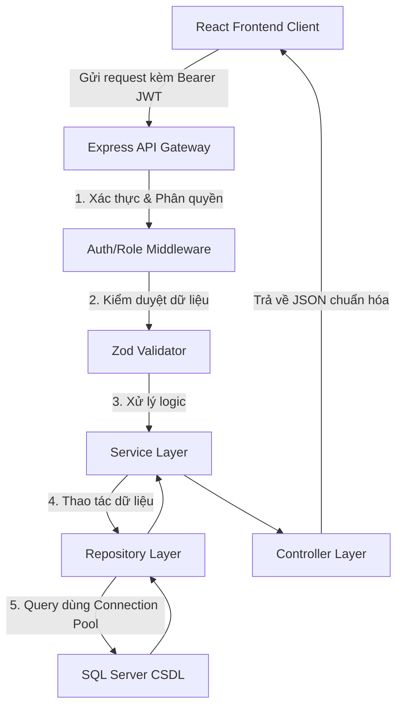

# AGENTS.md - Shopping Convenience System (Hệ thống Đi Chợ và Quản lý Kho Thực Phẩm)

Tài liệu này đóng vai trò là **Single Source of Truth** (Nguồn sự thật duy nhất) cho toàn bộ dự án, được thiết kế cho các AI coding agents và kỹ sư phát triển phần mềm để nắm bắt kiến trúc hệ thống, cấu trúc CSDL, quy tắc phát triển, và trạng thái hiện tại của dự án mà không cần phân tích lại toàn bộ repository.

---

## 1. Project Overview

*   **Mục tiêu dự án:** Xây dựng một hệ thống toàn diện hỗ trợ các gia đình lập kế hoạch bữa ăn, quản lý kho tủ lạnh, tự động hóa danh sách đi chợ, tối ưu hóa chi tiêu và giảm thiểu lãng phí thực phẩm.
*   **Bài toán giải quyết:**
    *   Lãng phí thực phẩm do quên hạn sử dụng.
    *   Tốn thời gian lên kế hoạch bữa ăn hàng ngày và đi chợ thủ công.
    *   Thiếu sự minh bạch và đồng bộ trong phân công mua sắm của các thành viên gia đình.
    *   Khó khăn trong kiểm soát chi tiêu và báo cáo tài chính gia đình.
*   **Đối tượng người dùng:** Hộ gia đình, các nhóm sống chung mong muốn chia sẻ và đồng bộ hóa hoạt động ăn uống, quản lý thực phẩm và chi tiêu.
*   **Các tính năng chính:**
    *   **Dashboard:** Hiển thị tổng quan hạn dùng thực phẩm, bữa ăn hôm nay, chi tiêu trong tuần và các lối tắt hành động nhanh.
    *   **Shopping List:** Quản lý danh sách mua sắm gia đình, phân chia người phụ trách, ghi nhận giá dự kiến và thực tế.
    *   **Inventory (Kho thực phẩm):** Theo dõi số lượng, vị trí lưu trữ (tủ lạnh, tủ đông, kệ tủ) và hạn sử dụng của từng lô thực phẩm.
    *   **Meal Plan:** Lên lịch ăn theo ngày và buổi (Sáng, Trưa, Tối, Phụ), tích hợp kiểm tra nguyên liệu thiếu trong kho.
    *   **Recipes:** Lưu trữ các công thức nấu ăn công khai (hệ thống) và riêng tư (gia đình), hỗ trợ tính toán nguyên liệu và hướng dẫn từng bước nấu.
    *   **Reports:** Thống kê chi tiêu thực tế, lượng lãng phí và năng lượng tiêu thụ dưới dạng biểu đồ trực quan.
    *   **Family Members:** Quản lý thành viên nhóm gia đình thông qua mã mời bảo mật và phân quyền vai trò (LEADER, MEMBER, VIEWER).
    *   **Admin Control:** Bảng quản trị hệ thống giúp giám sát người dùng, master data, nhật ký hệ thống (Audit Logs) và thống kê vận hành.
*   **Trạng thái hiện tại:** Hệ thống đã hoàn thiện khung sườn, build thành công cả Frontend và Backend, kết nối CSDL SQL Server hoạt động tốt. Tuy nhiên, codebase còn tồn tại **32 lỗi logic nghiệp vụ** và một số tính năng giả lập (fake) chưa kết nối API.

---

## 2. Repository Structure

Cây thư mục thực tế của dự án và chức năng của từng thư mục:

```text
DBLAB_ShoppingConvenienceSystem/
├── backend/
│   ├── dist/                # Mã nguồn JavaScript sau khi build từ TypeScript
│   ├── src/
│   │   ├── config/          # Cấu hình kết nối CSDL SQL Server, biến môi trường, logger
│   │   ├── core/            # Middleware dùng chung, hằng số và các helper tiện ích (jwt, hash, response)
│   │   │   ├── constants/   # Định nghĩa hằng số hệ thống
│   │   │   ├── middleware/  # Các bộ lọc Middleware (auth, role, error, validate)
│   │   │   └── utils/       # Tiện ích mã hóa mật khẩu, ký token, định dạng phản hồi
│   │   ├── jobs/            # Các tác vụ chạy ngầm định kỳ (quét hạn sử dụng thực phẩm - TODO)
│   │   ├── modules/         # Các module nghiệp vụ chính (mỗi module gồm controller, service, repository, route)
│   │   │   ├── admin/       # Nghiệp vụ quản trị hệ thống và báo cáo vận hành
│   │   │   ├── auth/        # Xác thực người dùng, cấp phát JWT và bảo mật 2FA
│   │   │   ├── family/      # Quản lý nhóm gia đình, mã mời và thành viên
│   │   │   ├── inventory/   # Quản lý kho nguyên liệu và nhật ký biến động kho
│   │   │   ├── meal-plan/   # Lên lịch ăn uống và thực đơn gia đình
│   │   │   ├── recipes/     # Quản lý công thức nấu ăn công cộng và riêng tư
│   │   │   ├── reports/     # Thống kê tài chính và phân tích lãng phí thực phẩm
│   │   │   ├── shopping/    # Quản lý danh sách đi chợ và chi tiết mua sắm
│   │   │   └── users/       # Quản lý thông tin hồ sơ cá nhân người dùng
│   │   ├── routes/          # Điểm tập trung các luồng API v1
│   │   ├── app.ts           # Cấu hình Express app, CORS, Cookie parser
│   │   └── server.ts        # Entry point khởi động Server HTTP native
│   ├── package.json         # Danh sách thư viện và script backend
│   └── tsconfig.json        # Cấu hình biên dịch TypeScript của backend
├── frontend/
│   ├── src/
│   │   ├── app/
│   │   │   ├── components/  # Chứa các component tái sử dụng và 35 file modal giao diện
│   │   │   │   ├── common/  # Các cửa sổ tương tác (Modal, Dialog)
│   │   │   │   ├── ui/      # Radix UI wrapper components
│   │   │   │   └── figma/   # Bản vẽ giao diện thô từ thiết kế Figma
│   │   │   ├── constants/   # Các giá trị cố định, cấu hình ngôn ngữ
│   │   │   ├── context/     # Quản lý trạng thái chia sẻ (Auth, Admin, Language, Toast)
│   │   │   ├── hooks/       # Custom React Hooks (useData truy xuất API, useToast thông báo nhanh)
│   │   │   ├── layouts/     # Bố cục giao diện (AdminLayout, AuthLayout, GuestLayout, MainLayout)
│   │   │   ├── pages/       # Các trang màn hình chính của ứng dụng
│   │   │   │   ├── Admin/   # Các trang dành cho Quản trị viên
│   │   │   │   ├── Auth/    # Màn hình đăng nhập, đăng ký, quên mật khẩu
│   │   │   │   └── ...      # Các trang tính năng (Dashboard, Inventory, MealPlan, Recipes, Reports, Settings, ShoppingList)
│   │   │   ├── services/    # api.ts định nghĩa fetch client cấu hình Concurrent Refreshing
│   │   │   ├── utils/       # Định dạng chuỗi, định vị avatar, phân tách kho
│   │   │   ├── App.tsx      # Component gốc định nghĩa Router Provider
│   │   │   └── routes.tsx   # Danh sách phân tuyến Router v7
│   │   ├── main.tsx         # File khởi tạo React 18 / DOM
│   │   ├── styles/          # Thư mục chứa CSS
│   │   │   └── index.css    # CSS tùy biến toàn hệ thống và cấu hình Tailwind v4
│   │   └── index.html       # File HTML gốc của client
│   ├── package.json         # Danh sách thư viện và script frontend
│   ├── vite.config.ts       # Cấu hình bundler Vite 6
│   └── tsconfig.json        # Cấu hình biên dịch TypeScript cho client
├── database/
│   ├── schema/              # Tập hợp các file khởi tạo cấu trúc CSDL SQL Server (01_init.sql đến 07_events.sql)
│   ├── migrations/          # File nâng cấp cơ sở dữ liệu (từ 001 đến 010) và dump SQL đầy đủ
│   └── database.slnx        # Tệp cấu trúc solution của Visual Studio
├── docs/
│   ├── api/                 # Tài liệu mô tả API đầu cuối (Trống)
│   ├── report/              # Báo cáo kỹ thuật của dự án (.tex)
│   └── uml/                 # Bản vẽ sơ đồ phân tích hoạt động (.drawio)
├── tests/
│   ├── api                  # Tập tin kiểm thử API (Trống)
│   └── sql                  # Tập tin kiểm thử SQL (Trống)
├── BaoCaoLoiHeThong.md      # Báo cáo phân tích chi tiết 32 lỗi logic nghiệp vụ trong codebase
└── README.md                # Tài liệu hướng dẫn cài đặt và mô tả tổng quan dự án
```

---

## 3. Tech Stack

### Frontend
*   **Framework:** React 18 (TypeScript)
*   **Build Tool:** Vite 6
*   **Routing:** React Router v7 (`react-router`)
*   **UI Library:** Radix UI primitives (`@radix-ui/react-*`), Lucide Icons (`lucide-react`), Motion (`motion` cho các vi hiệu ứng hoạt họa mượt mà).
*   **Styling:** Tailwind CSS v4 (`@tailwindcss/vite` & `tailwindcss`) kết hợp Vanilla CSS và PostCSS.
*   **Form Library:** React Hook Form (`react-hook-form`).
*   **Chart Library:** Recharts (`recharts` phục vụ báo cáo tài chính).
*   **Validation:** Không sử dụng Zod ở Frontend, việc kiểm duyệt được thực hiện qua các ràng buộc trong thẻ HTML input hoặc validate bằng mã JavaScript thuần.

### Backend
*   **Runtime:** Node.js (v18+)
*   **Language:** TypeScript (chạy trực tiếp thông qua `ts-node` và giám sát bằng `nodemon`).
*   **Framework:** Express 5 (`express` v5.2.1) - Lưu ý: Sử dụng Server HTTP native từ thư viện `http` để bọc Express app nhằm tránh hiện tượng "clean exit" khi chạy ngầm do cơ chế Promise-based mới của Express 5.
*   **Database Client:** Microsoft SQL Server client cho Node.js (`mssql` v12.5.0) thực hiện truy vấn raw SQL thông qua Connection Pool.
*   **Authentication:** JSON Web Token (`jsonwebtoken` v9.0.3) & mã hóa bảo mật mật khẩu bằng `bcryptjs` v3.0.3.
*   **2FA Engine:** Giải pháp TOTP thuần tự phát triển dựa trên HMAC-SHA1 thông qua thư viện native `crypto` của Node.js.
*   **Validation:** Sử dụng thư viện Zod (`zod` v4.3.6) làm middleware lọc sạch dữ liệu đầu vào (`validateRequest`).

### Database
*   **Engine:** Microsoft SQL Server (MSSQL).
*   **Connection Port:** Mặc định chạy ở cổng `1433`.
*   **Migration Strategy:** Sử dụng các file script SQL đánh số thứ tự chạy thủ công trên SQL Server Management Studio (SSMS) hoặc Visual Studio Solution.

### Infrastructure
*   **Hosting:** Localhost (Development environment).
*   **CI/CD:** Chưa cấu hình (Chạy thủ công).
*   **Storage:** Lưu trữ local (không tích hợp Cloud Storage, ảnh món ăn lưu trữ dưới dạng liên kết link ảnh ngoài hoặc base64).

---

## 4. System Architecture

Hệ thống được thiết kế theo mô hình **Client-Server** 3 lớp:
1.  **Presentation Layer (Frontend):** Ứng dụng Single Page Application (SPA) React giao tiếp qua các API HTTP RESTful đến Backend.
2.  **Application Layer (Backend API):** Thiết kế dạng phân tầng MVC đơn giản hóa:
    *   `Route` nhận yêu cầu HTTP.
    *   `Middleware` kiểm duyệt xác thực người dùng (`authenticate`), phân vai trò (`role`) và validate payload (`validateRequest`).
    *   `Controller` điều phối các luồng dữ liệu của request.
    *   `Service` giải quyết logic nghiệp vụ của ứng dụng.
    *   `Repository` thực hiện các truy vấn đọc ghi CSDL bằng các tham số hóa an toàn.
3.  **Data Layer (Database):** CSDL SQL Server lưu trữ dữ liệu, thực hiện tối ưu hóa qua các Stored Procedures (VD: `sp_TaoNhomGiaDinh`, `sp_HoanThanhMuaSamKho`), Indexes và Views báo cáo (`vw_ThucPhamSapHetHan`, `vw_ThongKeMuaSam`).

### Quy trình nghiệp vụ chính của hệ thống:



---

## 5. Database Design

Hệ thống sử dụng cơ sở dữ liệu quan hệ gồm các bảng chi tiết sau:

### 5.1. Bảng `NguoiDung` (Thông tin tài khoản và cấu hình bảo mật)
*   `MaNguoiDung` (INT, PK, IDENTITY): Mã định danh duy nhất của người dùng.
*   `HoTen` (NVARCHAR(100), NOT NULL): Họ và tên đầy đủ.
*   `Email` (NVARCHAR(100), NOT NULL, UNIQUE): Địa chỉ email đăng nhập.
*   `MatKhauHash` (NVARCHAR(255), NOT NULL): Mật khẩu đã băm bcrypt.
*   `SoDienThoai` (NVARCHAR(20), NULL): Số điện thoại liên lạc.
*   `Bio` (NVARCHAR(500), NULL): Phần mô tả ngắn về bản thân.
*   `VaiTro` (NVARCHAR(50), NOT NULL, Default: `'MEMBER'`): Vai trò hệ thống (`'ADMIN'`, `'MEMBER'`).
*   `TrangThai` (NVARCHAR(20), NOT NULL, Default: `'ACTIVE'`): Trạng thái hoạt động (`'ACTIVE'`, `'LOCKED'`).
*   `NgayTao` (DATETIME, Default: `GETDATE()`): Thời điểm tạo tài khoản.
*   `NgayCapNhat` (DATETIME, Default: `GETDATE()`): Thời điểm cập nhật tài khoản gần nhất.
*   `MatKhauNgayCapNhat` (DATETIME2, NOT NULL, Default: `GETUTCDATE()`): Thời điểm đổi mật khẩu gần nhất (dùng để vô hiệu hóa token cũ).
*   `TwoFactorSecret` (NVARCHAR(255), NULL): Khóa bí mật TOTP dùng cho 2FA.
*   `IsTwoFactorEnabled` (BIT, NOT NULL, Default: `0`): Trạng thái kích hoạt 2FA.

### 5.2. Bảng `NhomGiaDinh` (Thông tin nhóm gia đình)
*   `MaNhom` (INT, PK, IDENTITY): Mã định danh nhóm.
*   `TenNhom` (NVARCHAR(100), NOT NULL): Tên nhóm gia đình.
*   `TruongNhom` (INT, FK -> `NguoiDung.MaNguoiDung`, ON DELETE SET NULL): Mã trưởng nhóm.
*   `NgayTao` (DATETIME, Default: `GETDATE()`): Ngày thành lập nhóm.
*   `MaxThanhVien` (INT, NOT NULL, Default: `10`): Số lượng thành viên tối đa cho phép.
*   `MoTa` (NVARCHAR(500), NULL): Mô tả về gia đình.
*   `IsDeleted` (BIT, NOT NULL, Default: `0`): Trạng thái xóa mềm nhóm gia đình.
*   `NgayCapNhat` (DATETIME2, Default: `GETUTCDATE()`): Thời điểm cập nhật thông tin nhóm gần nhất.

### 5.3. Bảng `ThanhVienNhom` (Liên kết người dùng vào nhóm gia đình)
*   `MaNhom` (INT, PK, FK -> `NhomGiaDinh.MaNhom`, ON DELETE CASCADE): Mã nhóm gia đình.
*   `MaNguoiDung` (INT, PK, FK -> `NguoiDung.MaNguoiDung`, ON DELETE CASCADE): Mã người dùng thành viên.
*   `VaiTro` (NVARCHAR(50), NOT NULL, Default: `'MEMBER'`): Vai trò trong nhóm (`'LEADER'`, `'MEMBER'`, `'VIEWER'`).
*   `NgayThamGia` (DATETIME, Default: `GETDATE()`): Thời điểm tham gia gia đình.
*   `NgayCapNhat` (DATETIME2, Default: `GETUTCDATE()`): Thời điểm cập nhật trạng thái thành viên gần nhất.

### 5.4. Bảng `FamilyInvites` (Mã mời tham gia gia đình)
*   `Id` (INT, PK, IDENTITY): Định danh mã mời.
*   `Code` (NVARCHAR(50), NOT NULL, UNIQUE): Chuỗi mã mời ngẫu nhiên.
*   `MaNhom` (INT, FK -> `NhomGiaDinh.MaNhom`, ON DELETE CASCADE): Nhóm gia đình áp dụng mã mời.
*   `TaoBoiId` (INT, FK -> `NguoiDung.MaNguoiDung`, ON DELETE CASCADE): Thành viên tạo mã mời.
*   `UsedCount` (INT, NOT NULL, Default: `0`): Số lượng thành viên đã dùng mã để gia nhập.
*   `MaxUses` (INT, NOT NULL, Default: `10`): Giới hạn số lần sử dụng tối đa của mã mời.
*   `ExpiresAt` (DATETIME, NOT NULL): Thời hạn hết hạn của mã mời.
*   `IsDeleted` (BIT, NOT NULL, Default: `0`): Trạng thái xóa mềm mã mời.
*   `NgayTao` (DATETIME, Default: `GETUTCDATE()`): Thời gian tạo mã.
*   `NgayCapNhat` (DATETIME, Default: `GETUTCDATE()`): Thời gian cập nhật mã gần nhất.

### 5.5. Bảng `FamilyNotifications` (Hoạt động/Nhật ký nhóm gia đình)
*   `Id` (INT, PK, IDENTITY): Định danh thông báo.
*   `MaNhom` (INT, FK -> `NhomGiaDinh.MaNhom`, ON DELETE CASCADE): Nhóm gia đình liên quan.
*   `NoiDung` (NVARCHAR(500), NOT NULL): Nội dung nhật ký biến động.
*   `Loai` (NVARCHAR(50), NOT NULL): Thể loại sự kiện (`'JOIN'`, `'LEAVE'`, `'TRANSFER'`, `'INFO_UPDATE'`).
*   `NgayTao` (DATETIME2, NOT NULL, Default: `GETUTCDATE()`): Thời điểm xảy ra hoạt động.

### 5.6. Bảng `DanhSachMuaSam` (Phiên đi chợ)
*   `MaDanhSach` (INT, PK, IDENTITY): Mã danh sách đi chợ.
*   `MaNhom` (INT, FK -> `NhomGiaDinh.MaNhom`, ON DELETE CASCADE): Nhóm sở hữu danh sách.
*   `NgayTao` (DATE, Default: `CAST(GETDATE() AS DATE)`): Ngày tạo danh sách.
*   `TrangThai` (NVARCHAR(50), NOT NULL, Default: `'DANG_TAO'`): Trạng thái (`'DANG_TAO'`, `'COMPLETED'`).
*   `GhiChu` (NVARCHAR(255), NULL): Mô tả bổ sung.

### 5.7. Bảng `ChiTietMuaSam` (Mặt hàng chi tiết trong phiên đi chợ)
*   `MaCT` (INT, PK, IDENTITY): Mã mặt hàng mua sắm chi tiết.
*   `MaDanhSach` (INT, FK -> `DanhSachMuaSam.MaDanhSach`, ON DELETE CASCADE): Thuộc danh sách nào.
*   `TenThucPham` (NVARCHAR(100), NOT NULL): Tên nguyên liệu cần mua.
*   `SoLuong` (DECIMAL(10,2), NOT NULL): Số lượng yêu cầu (ràng buộc `> 0`).
*   `DonVi` (NVARCHAR(50), NULL): Đơn vị tính.
*   `NguoiPhuTrach` (INT, FK -> `NguoiDung.MaNguoiDung`, ON DELETE SET NULL): Người được giao đi mua.
*   `GiaDuKien` (DECIMAL(12,2), NOT NULL, Default: `0`): Ước tính chi phí (ràng buộc `>= 0`).
*   `GiaThucTe` (DECIMAL(12,2), NOT NULL, Default: `0`): Chi phí chi trả thực tế (ràng buộc `>= 0`).
*   `DaMua` (BIT, NOT NULL, Default: `0`): Đánh dấu đã mua thành công hay chưa.
*   `GhiChu` (NVARCHAR(255), NULL): Lưu ý riêng.
*   `DanhMucHang` (NVARCHAR(50), NULL): Nhóm quầy hàng trong siêu thị (VD: thịt, rau...).
*   `NgayMua` (DATETIME, NULL): Thời gian mặt hàng được tích chọn đã mua.
*   `MaNguoiMua` (INT, FK -> `NguoiDung.MaNguoiDung`, ON DELETE NO ACTION): Người thực tế tích mua hàng.

### 5.8. Bảng `KhoThucPham` (Kho chứa nguyên liệu của gia đình)
*   `MaTP` (INT, PK, IDENTITY): Mã định danh vật phẩm trong kho.
*   `MaNhom` (INT, FK -> `NhomGiaDinh.MaNhom`, ON DELETE CASCADE): Thuộc kho gia đình nào.
*   `TenTP` (NVARCHAR(100), NOT NULL): Tên thực phẩm trong kho.
*   `SoLuong` (DECIMAL(10,2), NOT NULL): Số lượng hiện tại (ràng buộc `>= 0`).
*   `DonVi` (NVARCHAR(50), NULL): Đơn vị tính.
*   `HanSuDung` (DATE, NULL): Hạn sử dụng của lô thực phẩm.
*   `ViTri` (NVARCHAR(100), NULL): Vị trí lưu trữ (`'Fridge'`, `'Freezer'`, `'Pantry'`).
*   `NgayNhap` (DATE, Default: `CAST(GETDATE() AS DATE)`): Ngày nạp vào kho.
*   `TrangThai` (NVARCHAR(30), NOT NULL, Default: `'CON_HAN'`): Trạng thái hết hạn (`'CON_HAN'`, `'HET_HAN'`).
*   `Version` (INT, NOT NULL, Default: `1`): Số phiên bản phục vụ khóa lạc quan (OCC) chống Dirty Write.
*   `NgayCapNhat` (DATETIME, Default: `GETDATE()`): Thời gian cập nhật kho gần nhất.

### 5.9. Bảng `NhatKyKho` (Ghi vết biến động kho)
*   `MaNhatKy` (INT, PK, IDENTITY): Định danh dòng nhật ký.
*   `MaTP` (INT, NULL): Mã liên kết thực phẩm (có thể NULL nếu thực phẩm đã bị xóa hoàn toàn).
*   `TenTP` (NVARCHAR(100), NOT NULL): Tên thực phẩm tại thời điểm ghi nhận.
*   `MaNhom` (INT, FK -> `NhomGiaDinh.MaNhom`, ON DELETE CASCADE): Mã nhóm gia đình thực hiện thay đổi.
*   `NguoiThucHien` (INT, FK -> `NguoiDung.MaNguoiDung`, ON DELETE SET NULL): Người dùng thực hiện thao tác.
*   `HanhDong` (NVARCHAR(50), NOT NULL): Hành vi tác động (`'THEM_MOI'`, `'CAP_NHAT'`, `'TIEU_THU'`, `'XOA'`).
*   `SoLuongTruoc` (DECIMAL(10,2), NULL): Lượng tồn kho trước tác vụ.
*   `SoLuongSau` (DECIMAL(10,2), NULL): Lượng tồn kho sau tác vụ.
*   `DonVi` (NVARCHAR(50), NULL): Đơn vị đo lường sử dụng.
*   `NgayThucHien` (DATETIME, Default: `GETDATE()`): Thời điểm ghi nhận.
*   `GhiChu` (NVARCHAR(255), NULL): Diễn giải bổ sung (VD: "Tiêu thụ làm món sườn xào chua ngọt").

### 5.10. Bảng `MonAn` (Danh mục công thức nấu ăn)
*   `MaMon` (INT, PK, IDENTITY): Định danh món ăn.
*   `TenMon` (NVARCHAR(200), NOT NULL): Tên công thức nấu.
*   `CongThuc` (NVARCHAR(MAX), NULL): Danh sách nguyên liệu cần thiết thô.
*   `HuongDan` (NVARCHAR(MAX), NULL): Các bước chế biến nấu ăn.
*   `NgayTao` (DATETIME, Default: `GETDATE()`): Ngày tạo công thức.
*   `MaNhom` (INT, FK -> `NhomGiaDinh.MaNhom`, ON DELETE SET NULL): NULL nếu là công thức công khai của hệ thống, ngược lại ghi nhận mã nhóm gia đình tạo riêng tư.
*   `MaNguoiTao` (INT, FK -> `NguoiDung.MaNguoiDung`, ON DELETE SET NULL): Mã thành viên viết công thức.
*   `ThoiGian` (INT, NULL): Thời gian chuẩn bị nấu (phút).
*   `KhauPhan` (INT, NULL): Số phần ăn mặc định.
*   `DoKho` (NVARCHAR(20), NULL): Độ khó thực hiện (`'Dễ'`, `'Trung bình'`, `'Khó'`).
*   `DanhMuc` (NVARCHAR(50), NULL): Phân loại món ăn (`'Món chính'`, `'Khai vị'`, `'Tráng miệng'`, `'Ăn nhẹ'`).
*   `MoTa` (NVARCHAR(500), NULL): Giới thiệu ngắn về món ăn.
*   `HinhAnh` (NVARCHAR(500), NULL): Liên kết hình ảnh minh họa món ăn.

### 5.11. Bảng `NguyenLieuMon` (Chi tiết nguyên liệu định lượng của công thức)
*   `MaMon` (INT, PK, FK -> `MonAn.MaMon`, ON DELETE CASCADE): Liên kết tới món ăn.
*   `MaTP` (INT, PK, FK -> `KhoThucPham.MaTP`, ON DELETE CASCADE): Liên kết tới loại thực phẩm mẫu tương ứng trong kho để kiểm tra tồn kho.
*   `SoLuongCan` (DECIMAL(10,2), NOT NULL): Định lượng khối lượng cần thiết để thực hiện món ăn (ràng buộc `> 0`).

### 5.12. Bảng `KeHoachBuaAn` (Lịch ăn uống thực đơn)
*   `MaKeHoach` (INT, PK, IDENTITY): Định danh kế hoạch.
*   `MaNhom` (INT, FK -> `NhomGiaDinh.MaNhom`, ON DELETE CASCADE): Thuộc gia đình nào.
*   `Ngay` (DATE, NOT NULL): Ngày thực hiện ăn uống.
*   `Buoi` (NVARCHAR(10), NOT NULL): Buổi ăn trong ngày (`'SANG'`, `'TRUA'`, `'TOI'`).
*   `MaMon` (INT, FK -> `MonAn.MaMon`, ON DELETE SET NULL): Món ăn được chọn lên lịch.
*   `GhiChu` (NVARCHAR(255), NULL): Lưu ý chuẩn bị bữa ăn.
*   `SoKhauPhan` (INT, NOT NULL, Default: `4`): Quy mô suất ăn cho bữa này.
*   `TenMonAn` (NVARCHAR(200), NULL): Tên món ăn sao lưu (tránh mất dữ liệu hiển thị lịch trình khi công thức bị xóa).

### 5.13. Bảng `BaoCaoChiTieu` (Chốt dữ liệu tài chính tài khóa)
*   `MaBaoCao` (INT, PK, IDENTITY): Định danh dòng chốt số liệu.
*   `MaNhom` (INT, FK -> `NhomGiaDinh.MaNhom`, ON DELETE CASCADE): Mã nhóm gia đình chốt số liệu.
*   `TuanThang` (NVARCHAR(50), NULL): Mốc thời gian tổng hợp (VD: `'Tuan 23 - 2026'`, `'Thang 05 - 2026'`).
*   `TongChiPhi` (DECIMAL(12,2), NOT NULL, Default: `0`): Tổng hóa đơn đi chợ thực tế trong kỳ (ràng buộc `>= 0`).
*   `TongLangPhi` (DECIMAL(12,2), NOT NULL, Default: `0`): Tổng giá trị thực phẩm bị hết hạn ném đi trong kỳ (ràng buộc `>= 0`).
*   `NgayTao` (DATETIME, Default: `GETDATE()`): Thời điểm chốt báo cáo.
*   `SoThanhVien` (INT, NOT NULL, Default: `1`): Số lượng thành viên của gia đình tại thời điểm chốt báo cáo.
*   `TongCalo` (INT, NOT NULL, Default: `0`): Tổng năng lượng tích lũy từ các bữa ăn kế hoạch trong kỳ.

### 5.14. Bảng `AuditLogs` (Lưu vết hành động của Admin quản trị)
*   `MaLog` (INT, PK, IDENTITY): Định danh log.
*   `MaAdmin` (INT, FK -> `NguoiDung.MaNguoiDung`, ON DELETE SET NULL): ID quản trị viên thực hiện hành động.
*   `HoTenAdmin` (NVARCHAR(100), NOT NULL): Tên hiển thị của admin.
*   `HanhDong` (NVARCHAR(100), NOT NULL): Tác vụ (VD: `'LOCK_USER'`, `'CLEANUP_USERS'`).
*   `Loai` (NVARCHAR(50), NOT NULL): Module bị tác động (`'auth'`, `'user'`, `'data'`, `'recipe'`, `'settings'`, `'report'`, `'shopping'`).
*   `TrangThai` (NVARCHAR(30), NOT NULL): Trạng thái xử lý (`'success'`, `'error'`, `'warning'`).
*   `MoTa` (NVARCHAR(500), NOT NULL): Diễn giải hành động cụ thể.
*   `DiaChiIP` (NVARCHAR(50), NOT NULL): Địa chỉ IP của quản trị viên khi tạo request.
*   `NgayTao` (DATETIME, Default: `GETDATE()`): Thời điểm thực hiện hành động.

---

## 6. Authentication & Authorization Flow

Hệ thống triển khai luồng xác thực bảo mật và phân quyền vai trò thông qua mã JWT và cơ chế bảo mật 2 lớp như sau:

### 6.1. Authentication Flow (Luồng Xác thực cơ bản)
1.  **Đăng nhập:** Người dùng gửi `email` và `password` đến `/api/v1/auth/login`.
    *   Hệ thống kiểm tra định dạng email và băm đối chiếu mật khẩu qua `bcryptjs`.
    *   Nếu tài khoản bị khóa (`TrangThai !== 'ACTIVE'`), trả về lỗi 403.
    *   Cập nhật `NgayCapNhat` của người dùng làm mốc đánh dấu `updateLastLogin`.
2.  **Cấp phát Token:**
    *   **Access Token:** Chứa thông tin payload gồm `id` (MaNguoiDung), `role` (VaiTro) và `pwdUpdatedAt` (Mốc thời gian đổi mật khẩu). Thời gian sống ngắn (mặc định cấu hình `24h` hoặc ít hơn trên production).
    *   **Refresh Token:** Chỉ chứa `id` của người dùng. Được đóng gói và gửi về Client qua **HttpOnly Cookie** có tên `refreshToken`, cấu hình thuộc tính `secure` trên môi trường production và giới hạn đường dẫn gửi nhận chỉ cho endpoint `/api/v1/auth/refresh` (`path: '/api/v1/auth/refresh'`).
3.  **Làm mới Token ngầm (Silent Token Refresh) & Concurrent Refreshing:**
    *   Khi Access Token hết hạn, API service ở Frontend (`api.ts`) nhận mã lỗi `401 Unauthorized` từ API.
    *   API service tự động kích hoạt tiến trình làm mới bằng cách gọi POST ngầm đến `/auth/refresh` mang theo Refresh Token trong Cookie.
    *   Để tối ưu hóa, Frontend sử dụng cờ hiệu `isRefreshing` và mảng `refreshSubscribers` để gom các request bị lỗi 401 đồng thời lại, chờ khi nhận Access Token mới sẽ tự động thực hiện lại toàn bộ mà không làm gián đoạn trải nghiệm người dùng.
    *   Nếu làm mới thất bại, Cookie refresh token bị xóa bỏ và Client bị đẩy về trang đăng nhập `/auth/login?expired=true`.
4.  **Vô hiệu hóa Token khi đổi mật khẩu:**
    *   Trong JWT payload của Access Token có nhúng `pwdUpdatedAt`.
    *   Tại middleware `authenticate`, nếu đang ở môi trường Production, hệ thống sẽ thực hiện đối chiếu chéo thời gian cập nhật mật khẩu gần nhất của người dùng trong DB (`MatKhauNgayCapNhat`) với `pwdUpdatedAt` của token.
    *   Nếu mật khẩu trong CSDL được cập nhật sau mốc phát hành token (sai số 1 giây), token đó lập tức bị coi là không hợp lệ và trả về 401 bắt đăng nhập lại.

### 6.2. Two-Factor Authentication (2FA TOTP)
*   **Thuật toán TOTP tự phát triển:** Hệ thống không dùng thư viện ngoài cho TOTP. Nó triển khai cơ chế sinh và xác thực mã 6 chữ số dựa trên thời gian HMAC-SHA1 thông qua thư viện core `crypto` của Node.js:
    *   **Sinh khóa (Setup):** Tạo chuỗi base32 ngẫu nhiên (`TwoFactorSecret`) lưu vào CSDL khi người dùng cấu hình 2FA và hiển thị mã QR.
    *   **Xác minh (Verify):** Đo chu kỳ thời gian 30 giây mặc định. Bù trừ sai lệch thời gian client-server bằng cách kiểm tra chu kỳ hiện tại kèm +/- 1 chu kỳ lân cận (tổng cộng cửa sổ kiểm tra là 90 giây). Sử dụng thuật toán:
        ```typescript
        const hmac = crypto.createHmac('sha1', secret);
        hmac.update(String(timeVal));
        const digest = hmac.digest('hex');
        const numeric = parseInt(digest.substring(0, 8), 16) % 1000000;
        const expectedToken = String(numeric).padStart(6, '0');
        ```
    *   **Trạng thái:** Lưu cột `IsTwoFactorEnabled = 1` trong bảng `NguoiDung` khi xác minh mã thử nghiệm thành công.

---

## 7. Command Reference & Scripts

Dự án sử dụng NPM để quản lý và vận hành. Chạy các lệnh tương ứng tại thư mục của từng phân vùng.

### Backend (`/backend`)
*   **Cài đặt thư viện:** `npm install`
*   **Chạy môi trường phát triển (Auto reload):** `npm run dev` (Khởi chạy nodemon và ts-node biên dịch trực tiếp)
*   **Chạy production:** `npm start` (Chạy file javascript sau khi build)
*   **Biên dịch dự án sang Javascript:** `npm run build` (Chạy trình biên dịch tsc)
*   **Dọn dẹp code đã build:** `npm run clean` (Xóa thư mục dist)

### Frontend (`/frontend`)
*   **Cài đặt thư viện:** `npm install` hoặc `pnpm install`
*   **Chạy dev server:** `npm run dev` (Vite dev server khởi tạo localhost mặc định cổng `5173`)
*   **Đóng gói dự án:** `npm run build` (Vite build tối ưu bundle)

### Database (`/database`)
*   Không có công cụ migration tự động. Thực hiện chạy các file script SQL trong thư mục `/database/schema` và `/database/migrations` bằng cách import trực tiếp vào công cụ SQL Server Management Studio (SSMS).

---

## 8. Coding Conventions & Code Style

Nhằm duy trì tính đồng bộ cao trong codebase, lập trình viên cần tuân thủ nghiêm ngặt các quy chuẩn sau:

### Backend
*   **Không lạm dụng `any`:** Enforce khai báo kiểu dữ liệu tường minh cho các payload, request và response (VD: kế thừa Request từ Express thành `AuthenticatedRequest` để quản lý thuộc tính `req.user`).
*   **Kiến trúc Phân tầng:** Tuyệt đối không viết trực tiếp logic nghiệp vụ hoặc truy vấn CSDL trong file Route hoặc Controller. Phải đi đúng trình tự: `Route` -> `Validate Middleware` -> `Controller` -> `Service` -> `Repository`.
*   **Bắt lỗi toàn cục:** Mọi controller bắt buộc phải bọc trong khối `try-catch` và chuyển lỗi về `next(e)` để middleware xử lý lỗi tập trung xử lý.
*   **Tham số hóa truy vấn SQL (SQL Parameterization):** Tuyệt đối không cộng chuỗi SQL để tránh SQL Injection. Luôn sử dụng `.input()` của thư viện `mssql` để gán tham số hóa.
*   **Connection Pool:** Sử dụng hàm tiện ích `getPool()` đã tối ưu sẵn thay vì tạo mới connection liên tục để tránh rò rỉ tài nguyên mạng của máy chủ SQL.

### Frontend
*   **Named Exports:** Sử dụng Named Exports cho các trang (Page) và component thay vì default exports (VD: `export const Dashboard = ...` để import dạng `import { Dashboard } from ...`).
*   **State Management:**
    *   Sử dụng local state (`useState`) cho các biến cục bộ trong component hoặc modal.
    *   Sử dụng React Contexts để quản lý các trạng thái toàn cục (Ngôn ngữ, Xác thực, Giao diện Admin).
*   **Custom React Hooks:** Tách biệt toàn bộ logic gọi API và xử lý dữ liệu phức tạp ra khỏi file giao diện `.tsx` bằng cách bọc chúng trong các custom hooks (VD: `useData.ts`). File UI chỉ đảm nhiệm việc render HTML và bắt sự kiện.
*   **Radix UI Wrappers:** Luôn sử dụng các component ui dùng chung đã cấu hình sẵn trong thư mục `/components/ui` để đảm bảo đồng bộ về giao diện và khả năng hỗ trợ bàn phím (Accessibility).

---

## 9. State Management & Hooks

Hệ thống quản lý trạng thái phân tầng từ toàn cục đến cục bộ:

### 9.1. React Contexts (Trạng thái toàn cục)
*   [AuthContext.tsx](file:///c:/Users/KHANH/Documents/GitHub/DBLAB_ShoppingConvenienceSystem/frontend/src/app/context/AuthContext.tsx): Lưu giữ thông tin người dùng đang đăng nhập (`user`), token xác thực và trạng thái kích hoạt 2FA. Tự động đồng bộ với `localStorage` để chống mất phiên khi F5 tải lại trang.
*   [AdminContext.tsx](file:///c:/Users/KHANH/Documents/GitHub/DBLAB_ShoppingConvenienceSystem/frontend/src/app/context/AdminContext.tsx): Quản lý luồng dữ liệu cho trang Admin, nắm giữ danh sách tài khoản, nhật ký thao tác và thống kê người dùng của hệ thống.
*   [LanguageContext.tsx](file:///c:/Users/KHANH/Documents/GitHub/DBLAB_ShoppingConvenienceSystem/frontend/src/app/context/LanguageContext.tsx): Đảm nhận cấu hình chuyển đổi ngôn ngữ (Tiếng Việt / Tiếng Anh) trong ứng dụng.
*   [ToastContext.tsx](file:///c:/Users/KHANH/Documents/GitHub/DBLAB_ShoppingConvenienceSystem/frontend/src/app/context/ToastContext.tsx): Quản lý hệ thống thông báo trạng thái dạng pop-up nhanh (Toast) của toàn bộ ứng dụng.

### 9.2. Custom Hooks (Logic xử lý tách biệt)
*   [useData.ts](file:///c:/Users/KHANH/Documents/GitHub/DBLAB_ShoppingConvenienceSystem/frontend/src/app/hooks/useData.ts): Custom hook chủ đạo của dự án, đóng vai trò là "máy kéo" dữ liệu từ API. Quản lý trạng thái tải (`loading`), lỗi (`error`), và cung cấp các hàm nạp lại dữ liệu (`reload`), tương tác kho, mua sắm.
*   [useToast.ts](file:///c:/Users/KHANH/Documents/GitHub/DBLAB_ShoppingConvenienceSystem/frontend/src/app/hooks/useToast.ts): Hook tiện ích giúp hiển thị nhanh các thông báo dạng Toast mà không cần import thủ công Context Provider ở các component con.

---

## 10. Styling & UI Components

### Giao diện và Phong cách thiết kế
*   Hệ thống được thiết kế theo phong cách hiện đại với màu sắc hài hòa, độ tương phản tốt, sử dụng phông chữ không chân hiện đại từ Google Fonts.
*   Ứng dụng sử dụng Tailwind CSS v4 để tối ưu hóa thiết kế đáp ứng (Responsive Layout) tương thích tốt trên cả Mobile, Tablet và Desktop.
*   Các vi hiệu ứng di chuột (Hover effects), mở modal mượt mà được cấu hình sẵn nhờ thư viện `motion` và hiệu ứng confetty chúc mừng khi hoàn thành mua sắm (`canvas-confetti`).

### Phân vùng Components
*   `/components/ui/`: Chứa các component nguyên tử dùng chung (Buttons, Inputs, Badges, Cards) được bọc từ Radix UI.
*   `/components/common/`: Gồm 35 file modal giao diện đóng vai trò tương tác động của dự án (Thêm kho, Sửa thành viên, Xuất báo cáo, Quản lý quyền, Cấu hình thực đơn...).

---

## 11. Form Handling & Validation

*   **Frontend:** Việc nhập liệu ở các modal được bọc trong bộ quản lý của thư viện `react-hook-form`. Nó giúp bắt trạng thái thay đổi của từng ô input và ngăn chặn việc submit form khi chưa nhập đầy đủ các trường bắt buộc thông qua thuộc tính `required` HTML5.
*   **Backend:** Sử dụng Zod để xây dựng Schema kiểm tra tính đúng đắn của dữ liệu đầu vào trước khi thực thi mã nguồn xử lý. Middleware `validateRequest` chịu trách nhiệm lọc và ném lỗi 400 Bad Request nếu thông tin gửi lên sai định dạng:
    *   `loginSchema`: Yêu cầu trường `email` đúng định dạng email và mật khẩu tối thiểu 5 ký tự.
    *   `registerSchema`: Yêu cầu các trường `hoTen`, `email` định dạng đúng và mật khẩu tối thiểu 5 ký tự (đã loại bỏ các ràng buộc phức tạp về chữ hoa, chữ thường và số).

---

## 12. Error Handling & Response Standard

Hệ thống đồng bộ hóa giao tiếp thông tin lỗi và phản hồi JSON:

### 12.1. Cấu trúc Response chuẩn hóa
Mọi API phản hồi từ backend đều tuân thủ cấu trúc dữ liệu JSON thống nhất:
*   **Thành công (200, 201):** `{ success: true, data: [...], message: "Thông báo thành công" }`
*   **Thất bại (400, 401, 403, 404, 500):** `{ success: false, message: "Chi tiết lỗi xảy ra" }`

### 12.2. Error Middleware tập trung
*   Mọi lỗi phát sinh trong luồng xử lý hoặc do CSDL ném ra được bắt lại và chuyển về [error.middleware.ts](file:///c:/Users/KHANH/Documents/GitHub/DBLAB_ShoppingConvenienceSystem/backend/src/core/middleware/error.middleware.ts).
*   Middleware sẽ tự động phân loại mã lỗi (Mã 400 cho lỗi validate đầu vào, 401 cho xác thực, 409 cho xung đột trùng lặp khóa CSDL và mặc định 500 cho các lỗi logic hệ thống hoặc kết nối CSDL), tiến hành ghi nhật ký lỗi (Logger) và trả về phản hồi JSON chuẩn hóa cho Client.

---

## 13. Core Business Workflows

Dưới đây là các luồng xử lý nghiệp vụ liên kết chính của dự án:

### 13.1. Đi chợ hoàn thành -> Tự động nạp vào Kho thực phẩm
*   Khi người dùng tích chọn toàn bộ các mặt hàng cần mua trên giao diện Shopping List và nhấn nút "Hoàn thành đi chợ", Frontend sẽ kích hoạt gọi API chuyển trạng thái danh sách.
*   Backend gọi Stored Procedure `sp_HoanThanhMuaSamKho` thực hiện giao dịch (Transaction):
    *   Lọc ra toàn bộ mặt hàng có `DaMua = 1` trong bảng `ChiTietMuaSam` thuộc danh sách.
    *   Chèn các mặt hàng đó vào bảng `KhoThucPham` với thông tin tên, số lượng, đơn vị tương ứng.
    *   Chuyển trạng thái danh sách đi chợ thành `'COMPLETED'`.
    *   Ghi nhật ký biến động kho `NhatKyKho` với hành động `'THEM_MOI'` cho từng thực phẩm.

### 13.2. Lên kế hoạch bữa ăn -> Kiểm tra tồn kho & Tự động tạo danh sách mua sắm thiếu
*   Khi chuẩn bị nấu một món ăn trong lịch trình `KeHoachBuaAn`, hệ thống sẽ đối chiếu nguyên liệu cần của món ăn trong bảng `NguyenLieuMon` với số lượng khả dụng trong kho `KhoThucPham`.
*   Nếu kho không đủ số lượng hoặc thiếu nguyên liệu, hệ thống hiển thị cảnh báo nguyên liệu thiếu cho người dùng.
*   Người dùng có thể bấm nút "Mua sắm siêu tốc" để hệ thống tự động gom toàn bộ nguyên liệu thiếu, tạo ra một danh sách đi chợ mới (`DanhSachMuaSam`) mang trạng thái `'DANG_TAO'` kèm theo các chi tiết mua sắm đúng định lượng bị thiếu để đi siêu thị mua bổ sung.

---

## 14. Timezone & Localization

*   **Xử lý Múi giờ tài chính (Timezone Offset Security):**
    *   Mọi thông số ngày giờ trong CSDL SQL Server được lưu ở dạng UTC để đảm bảo tính nhất quán của hệ thống.
    *   Để tránh việc chênh lệch ngày báo cáo khi máy chủ chạy múi giờ UTC khác với múi giờ của gia đình ở Việt Nam (UTC+7), khi gọi các API thống kê tài chính ở trang Báo cáo (`/reports/summary`), Frontend sẽ truyền tham số `timezoneOffset` (tính bằng phút) lên backend.
    *   Truy vấn SQL tại backend sử dụng các hàm `DATEADD` và `CAST` chuẩn hóa mốc thời gian khớp với múi giờ địa phương của gia đình trước khi tính toán tổng chi tiêu và lãng phí trong khoảng ngày lọc.
*   **Đa ngôn ngữ (Localization):**
    *   Hiện tại hệ thống định nghĩa `LanguageContext` để quản lý ngôn ngữ hiển thị. Tuy nhiên giao diện thực tế của ứng dụng đang được viết cứng (hardcode) bằng Tiếng Việt. Tính năng dịch thuật thực tế sang Tiếng Anh chưa được cấu hình các bộ từ khóa biên dịch.

---

## 15. Offline Resilience

*   Ứng dụng đi chợ thường được dùng tại tầng hầm siêu thị nơi sóng điện thoại yếu hoặc mất mạng hoàn toàn.
*   **Hiện trạng:** Hệ thống chưa được tích hợp Service Worker hay cơ chế lưu trữ tạm IndexedDB / Offline Cache dưới thiết bị.
*   **Hướng đi tương lai:** Cần cấu hình PWA (Progressive Web App) để lưu trữ danh sách mua sắm tạm thời khi mất kết nối mạng và tự động đồng bộ (Sync) lên máy chủ khi thiết bị có kết nối Internet trở lại.

---

## 16. Environment Configuration

### Backend (`/backend/.env`)
*   `SERVER_PORT`: Cổng khởi chạy Server Backend (Mặc định: `5000`).
*   `NODE_ENV`: Môi trường chạy (`'development'` hoặc `'production'`).
*   `CLIENT_URL`: URL của client để phân quyền CORS (Mặc định: `http://localhost:5173`).
*   `DB_HOST`: Địa chỉ IP/Domain máy chủ SQL Server.
*   `DB_USER`: Tài khoản đăng nhập SQL Server.
*   `DB_PASS`: Mật khẩu đăng nhập SQL Server.
*   `DB_NAME`: Tên cơ sở dữ liệu (`'shoppingdb'`).
*   `DB_PORT`: Cổng dịch vụ SQL Server (Mặc định: `1433`).
*   `DB_INSTANCE`: Tên instance của SQL Server (nếu cấu hình instance động).
*   `JWT_SECRET`: Chuỗi khóa bí mật mã hóa chữ ký Access Token.
*   `JWT_EXPIRE`: Thời gian sống của Access Token (Mặc định: `'24h'`).

### Frontend (`/frontend/.env.local`)
*   `VITE_API_URL`: URL API trỏ về Backend (Mặc định: `http://localhost:5000/api/v1`).

---

## 17. Current Project Status & Roadmap

### 17.1. Các phần đang dang dở (Bao gồm 32 lỗi logic nghiệp vụ được phát hiện):
1.  **Dashboard (3 lỗi):**
    *   Bốn thẻ số liệu dưới trang bị hardcode chữ số cứng, không liên kết API.
    *   Thêm nhanh bữa ăn luôn bị gán cứng ID món ăn `maMon = 1`.
    *   Thêm bữa ăn từ Dashboard bị ghi đè ngày hiện tại, bỏ qua ngày người dùng chọn trên lịch.
2.  **Shopping List (4 lỗi):**
    *   Tổng chi phí đã mua tính toán sai do sai thứ tự ưu tiên toán tử cộng và logic OR (`s + i.actualPrice || i.price` thay vì `s + (i.actualPrice || i.price)`).
    *   Nút xuất file PDF và nút chia sẻ liên kết danh sách đi chợ chỉ hiện thông báo toast giả, không có logic thực thi tải file hay chia sẻ thật.
    *   Thiếu dependency `loadItems` trong useEffect nạp dữ liệu.
3.  **Inventory (5 lỗi):**
    *   Modal "Thêm thủ công" bị lỗi submit do đọc nhầm dữ liệu từ các state của form "Thêm nhanh" bên ngoài thay vì nhận dữ liệu truyền ngược từ modal.
    *   Thiếu nút bấm xem chi tiết thực phẩm trên thẻ card nguyên liệu để kích hoạt mở modal xem chi tiết.
    *   Form "Thêm nhanh" bên phải trang bỏ qua hoàn toàn hai trường Danh mục và Ghi chú khi gửi API.
    *   Nút submit thêm nhanh bị viết cứng nhãn "Thêm vào tủ lạnh" thay vì hiển thị linh hoạt theo vị trí chọn.
    *   Nút giảm nhanh số lượng nguyên liệu gộp (-1) luôn trừ vào lô đầu tiên trong mảng mà không kiểm tra lô đó còn hàng hay không.
4.  **Meal Plan (2 lỗi):**
    *   Buổi ăn "Phụ" bị thiếu trong bộ ánh xạ của trang, dẫn đến khi nạp lên API bị biến thành `undefined` hoặc nhảy sang bữa tối.
    *   Nút "Tạo thực đơn tự động" chỉ nạp lại trang mà không có logic gọi API gợi ý của AI.
5.  **Recipes (4 lỗi):**
    *   Xóa công thức nấu ăn không hiển thị hộp thoại xác nhận.
    *   Nguy cơ vòng lặp vô tận (Infinite Loop) trong `CookingModal` do khởi tạo mảng `steps` mới làm thay đổi tham chiếu React Hook liên tục mỗi lần re-render.
    *   Dropdown chọn công thức nấu ăn của modal thêm bữa ăn gọi API thiếu tham số `groupId` dẫn đến chỉ tải các công thức mẫu của hệ thống, ẩn đi các công thức riêng của gia đình.
    *   Lập lịch ăn trực tiếp từ trang công thức nấu bị thiếu thông tin số khẩu phần ăn gửi lên API.
6.  **Reports (2 lỗi):**
    *   Chỉ số tiền tiết kiệm tối ưu kho bị tính toán giả lập cứng bằng 15% tổng chi tiêu thực tế.
    *   Toast báo thành công hiển thị nội dung chứa chữ `undefined` do truy xuất sai thuộc tính phản hồi `res.message` không tồn tại.
7.  **Family Members (2 lỗi):**
    *   Chức năng sửa thông tin thành viên gia đình và phân vai trò hoạt động giả, không hề gọi API để lưu lại vào cơ sở dữ liệu.
8.  **Settings (4 lỗi):**
    *   Bật tắt công tắc cấu hình thông báo chỉ thay đổi state cục bộ, bị mất khi tải lại trang.
    *   Chọn thay đổi ngôn ngữ sang Tiếng Anh không có tác dụng dịch thuật.
    *   Nút "Xóa tài khoản" chỉ hiển thị toast cảnh báo, không xóa dữ liệu thật.
    *   Nút đăng tải ảnh đại diện hiển thị thông báo "Tính năng đang phát triển".
9.  **Auth & Navigation (3 lỗi):**
    *   Đường dẫn tự động đẩy đi khi token hết hạn bị sai đường dẫn tĩnh gây lỗi 404 (`/login?expired=true` trong khi route đúng là `/auth/login?expired=true`).
    *   Route trang Dashboard bị trùng lặp ở cả `/app` và `/app/dashboard`.
    *   Sự kiện click bữa ăn ngày hôm nay tạo timeout điều hướng xếp chồng nếu bấm liên tiếp.
10. **Backend API (3 lỗi):**
    *   Ngưỡng quét thực phẩm sắp hết hạn bị gán cứng giá trị `3` ngày ở code service backend.
    *   API lấy nhật ký kho sử dụng path parameter thay vì query parameter như các API inventory khác.
    *   Dư thừa kiểm tra `checkRes.ok` trong `AuthContext` gây cảnh báo linter.

### 17.2. Các tính năng chưa bắt đầu (Not Started):
*   Tác vụ chạy ngầm định kỳ quét hạn sử dụng thực phẩm để gửi email cảnh báo tự động.
*   Công cụ quét hóa đơn mua sắm siêu thị qua ảnh chụp bằng công nghệ OCR để tự động hóa khâu nạp kho.
*   Tích hợp mô hình ngôn ngữ lớn (LLM) để gợi ý thực đơn ăn uống dựa trên nguyên liệu sắp hết hạn thực tế trong kho.
*   Cơ chế Offline Sync hỗ trợ sử dụng checklist khi đi chợ không có sóng mạng.

---

## 18. Development History Summary

Lịch sử phát triển và nâng cấp cơ sở dữ liệu của dự án trải qua các giai đoạn:

### Phase 1: Xây dựng nền tảng và Cấu trúc cốt lõi
*   Thiết kế cấu trúc thư mục phân tầng cho Frontend (React/Vite) và Backend (Node/Express).
*   Khởi tạo cấu trúc cơ sở dữ liệu nền móng gồm 10 bảng cốt lõi phục vụ các thực thể tài khoản (`NguoiDung`), nhóm gia đình (`NhomGiaDinh`), kho nguyên liệu (`KhoThucPham`), công thức (`MonAn`), thực đơn (`KeHoachBuaAn`) và đi chợ (`DanhSachMuaSam`).
*   Viết các stored procedure tối ưu hóa tác vụ tạo nhóm gia đình và tự động Restock nạp kho khi đi siêu thị về.

### Phase 2: Nâng cấp Hệ thống Mời gia đình và Bảo mật Xác thực
*   **Family Invite System:** Xây dựng bảng `FamilyInvites` lưu vết các mã mời tham gia nhóm ngẫu nhiên, cài đặt thời gian hết hạn mã và giới hạn số lần sử dụng tối đa.
*   **Security Upgrades:** Nâng cấp bảng người dùng hỗ trợ bảo mật 2 lớp (MFA TOTP), bổ sung khóa bí mật `TwoFactorSecret` và trạng thái `IsTwoFactorEnabled`. Thêm cột `MatKhauNgayCapNhat` để theo dõi và chủ động vô hiệu hóa lập tức các Access Token cũ khi người dùng thay đổi mật khẩu.
*   **FK Cascade Upgrades:** Thiết lập bảng nhật ký nhóm `FamilyNotifications` và tối ưu các khóa ngoại cơ sở dữ liệu sang cơ chế `ON DELETE CASCADE` (VD: khi tài khoản bị xóa, tự động xóa sạch các mã mời tương ứng để tránh rò rỉ hoặc gây lỗi khóa ngoại vật lý treo database).

### Phase 3: Tối ưu hóa Nghiệp vụ Kho, Công thức và Báo cáo tài chính
*   **Inventory Upgrades:** Thêm trường `Version` cho bảng Kho thực phẩm để kiểm tra xung đột cập nhật đồng thời (Optimistic Concurrency Control - OCC). Tạo bảng nhật ký kho `NhatKyKho` ghi nhận chi tiết lịch sử nạp kho, tiêu thụ nguyên liệu và hủy bỏ thực phẩm hỏng.
*   **Meal Plan Upgrades:** Nâng cấp bảng kế hoạch bữa ăn hỗ trợ lưu trữ số khẩu phần ăn `SoKhauPhan` động và sao lưu tên món ăn `TenMonAn` để bảo toàn lịch sử thực đơn.
*   **Recipes Upgrades:** Nâng cấp công thức nấu ăn (`MonAn`) hỗ trợ ghi nhận phân quyền sở hữu theo nhóm gia đình và lưu trữ các metadata chi tiết (Khẩu phần ăn, Danh mục món, Độ khó nấu, Thời gian thực hiện, Hình ảnh minh họa).
*   **Shopping Upgrades:** Bổ sung cột danh mục quầy hàng (`DanhMucHang`), ngày mua thực tế (`NgayMua`) và mã định danh người mua cụ thể (`MaNguoiMua`) trong chi tiết mua sắm để phục vụ tính minh bạch chi tiêu trong gia đình.
*   **Reports & Admin Dashboard:** Nâng cấp báo cáo tài chính chốt số lượng thành viên lịch sử gia đình (`SoThanhVien`) và năng lượng tiêu thụ (`TongCalo`). Khởi tạo bảng `AuditLogs` lưu trữ lịch sử tác vụ của quản trị viên hệ thống để tăng tính bảo mật giám sát.
