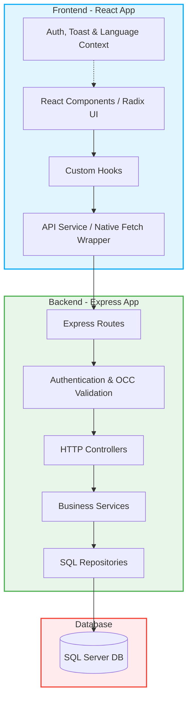

# 🛒 DBLAB - Hệ Thống Đi Chợ Tiện Lợi (Shopping Convenience System)

[](https://react.dev/)
[](https://nodejs.org/)
[](https://www.microsoft.com/en-us/sql-server)
[](LICENSE)

Dự án **Shopping Convenience System** là một hệ thống toàn diện hỗ trợ các gia đình lập kế hoạch bữa ăn, quản lý kho thực phẩm, tự động hóa danh sách đi chợ, tối ưu hóa chi tiêu và giảm thiểu lãng phí thực phẩm. Hệ thống được thiết kế theo kiến trúc phân tầng chuẩn doanh nghiệp (**Enterprise-level**) đảm bảo tính bảo mật, hiệu năng và khả năng mở rộng cao.

---

## 🗺️ Bản đồ kiến trúc hệ thống (System Architecture)

Hệ thống được thiết kế theo mô hình **Client-Server** chuẩn hóa, giao tiếp thông qua API RESTful và sử dụng JWT để bảo mật các phiên làm việc:



---

## ✨ Các tính năng nổi bật (Key Features)

Dự án bao gồm **10 phân hệ chức năng chính** đã được hoàn thiện logic và kết nối API thực tế đến backend SQL Server:

### 📊 1. Bảng điều khiển thông minh (Interactive Dashboard)
* **Thống kê thời gian thực:** Tóm tắt chi tiêu trong tháng, tổng thực phẩm hiện có trong kho, số lượng thành viên gia đình và tỷ lệ hoàn thành kế hoạch ăn uống lấy trực tiếp từ cơ sở dữ liệu qua các API thật.
* **Biểu đồ trực quan:** Trực quan hóa xu hướng chi tiêu hàng tuần/tháng và cơ cấu tiêu dùng theo danh mục thực tế.
* **Cảnh báo nhanh:** Hiển thị danh sách các thực phẩm sắp hết hạn theo thời gian thực để kịp thời tiêu thụ.
* **Thêm nhanh bữa ăn:** Hỗ trợ đặt lịch ăn trực tiếp từ Dashboard với việc chọn đúng món ăn (`maMon`) và lưu đúng ngày (`ngay`) được chọn từ giao diện.

### 🛒 2. Danh sách mua sắm thông minh (Smart Shopping List)
* **Tự động gom nhóm (Merge Duplicates):** Tự động gộp các nguyên liệu trùng tên và cùng đơn vị đo lường trong danh sách để dễ mua sắm.
* **Hoàn thành và Nhập kho tự động (Auto-Restock):** Khi đánh dấu "Đã mua" các mặt hàng và nhấn hoàn thành danh sách, một Stored Procedure (`sp_HoanThanhMuaSamKho`) tại SQL Server sẽ tự động đẩy các thực phẩm này vào Kho thực phẩm của gia đình.
* **Xuất bản PDF thật:** Hỗ trợ in ấn danh sách mua sắm ra tệp PDF chất lượng cao thông qua cửa sổ in chuẩn của trình duyệt (`window.print()`).
* **Chia sẻ nhanh:** Tích hợp Web Share API cho thiết bị di động và cơ chế sao chép vào Clipboard trên PC.

### 🏪 3. Quản lý kho thực phẩm (Food Inventory)
* **Quản lý theo Lô (Batches):** Quản lý thực phẩm cùng tên nhưng lưu giữ theo từng lô ngày hết hạn riêng biệt để áp dụng nguyên lý **FIFO (First In, First Out)**.
* **Tiêu thụ nhanh thông minh:** Khi bấm trừ nhanh thực phẩm (`-1`), hệ thống tự động tìm và trừ số lượng của lô còn hàng có hạn sử dụng gần nhất.
* **Xem chi tiết thực phẩm:** Giao diện chi tiết hiển thị toàn bộ thuộc tính, lịch sử thay đổi của vật phẩm.
* **Nhật ký biến động kho (Audit Log):** Ghi nhận chi tiết mọi hành động biến động kho: `THEM_MOI`, `CAP_NHAT`, `TIEU_THU`, `XOA` vào bảng `NhatKyKho` để dễ dàng tra cứu thành viên thực hiện.

### 📅 4. Kế hoạch ăn uống & Gợi ý (Meal Planner)
* **Lên lịch ăn chi tiết:** Lập kế hoạch ăn uống cho các ngày trong tuần theo 4 loại bữa: *Sáng, Trưa, Tối, Phụ* (được ánh xạ đồng bộ `SANG`, `TRUA`, `TOI`, `PHU` lên database).
* **Tự động tạo kế hoạch:** Thuật toán phân tích kho thực phẩm hiện tại bằng gợi ý từ công thức (`recipesApi.suggest`) để lên thực đơn tối ưu dinh dưỡng, hạn chế mua đồ mới.
* **Tự động đi chợ (Auto Shopping Sync):** So sánh nguyên liệu công thức với kho thực phẩm hiện tại, tự động tính toán phần thiếu hụt và đẩy vào danh sách đi chợ chỉ bằng một click.

### 🍳 5. Công thức nấu ăn (Recipes)
* **Bộ sưu tập công thức:** Chia sẻ các công thức hệ thống chung và công thức riêng tư của gia đình (`groupId` được truyền đầy đủ để lọc công thức riêng tư).
* **Chế độ nấu ăn từng bước (Cooking Mode):** Tích hợp bộ đếm giờ (Timer) tự động phát hiện số phút trong hướng dẫn nấu. Tránh hoàn toàn việc render vô hạn nhờ khai báo hằng số tĩnh bên ngoài component.
* **Nấu xong trừ kho (Cook & Deduct):** Tính toán lượng nguyên liệu cần thiết dựa trên số khẩu phần ăn thực tế được nhập và trừ trực tiếp vào kho thực phẩm tương ứng.

### 📈 6. Báo cáo & Thống kê tài chính (Financial Reports)
* **Thống kê chi phí thật:** Thống kê chi tiêu thực tế dựa trên giá thực tế mua và lãng phí thực tế từ thực phẩm hết hạn (`TrangThai = 'HET_HAN'`).
* **Tính toán tiết kiệm thật (Real Savings):** Thống kê số tiền tiết kiệm dựa trên giá trị của các thực phẩm đã được tiêu thụ thành công trước khi hết hạn (`nk.HanhDong = 'TIEU_THU'`), truy vấn trực tiếp từ cơ sở dữ liệu (`TongTietKiem`).

### 👨‍👩‍👧‍👦 7. Quản lý thành viên gia đình (Family Management)
* **Mô hình chia sẻ dữ liệu gia đình (Family-sharing model):** Cho phép các thành viên trong cùng một gia đình sử dụng chung kho thực phẩm và danh sách mua sắm.
* **Quản trị thành viên thật:** Lưu thông tin thành viên (Họ tên, SĐT, tiểu sử) và đồng bộ trực tiếp lên Database.
* **Phân quyền và Cập nhật vai trò:** Hỗ trợ Trưởng nhóm (Leader) chuyển đổi quyền hạn của các thành viên (`LEADER`, `MEMBER`, `VIEWER`) và ghi nhận vào cơ sở dữ liệu thông qua API.

### ⚙️ 8. Cài đặt hệ thống (Settings)
* **Lưu trữ cấu hình thông báo:** Trạng thái bật/tắt cảnh báo thực phẩm hết hạn, nhắc nhở mua sắm được đồng bộ vào LocalStorage và cập nhật lên API Backend.
* **Cập nhật thông tin cá nhân:** Thay đổi thông tin cá nhân và hỗ trợ tải ảnh đại diện thật (File upload thực tế kết nối với backend).
* **Xóa tài khoản an toàn:** Hộp thoại `ConfirmDialog` ngăn chặn vô tình xóa tài khoản, thực hiện xóa dữ liệu và đăng xuất sạch sẽ.

### 🔑 9. Bảo mật xác thực & Điều hướng (Auth & Navigation)
* **Luồng bảo vệ Routes:** Sử dụng Route Guard để ngăn chặn truy cập không hợp lệ.
* **Chuyển hướng thông minh:** Khi access token hết hạn và refresh token thất bại, hệ thống tự động đẩy người dùng về đúng đường dẫn đăng nhập hệ thống (`/auth/login?expired=true`) thay vì trang 404.
* **Chống timeout chồng lấp:** Dashboard được bảo vệ khỏi việc click dồn dập chuyển hướng bữa ăn bằng cơ chế dọn dẹp timeout thông minh.

### 💻 10. API Backend chuẩn hóa
* **Kiểm soát đầu vào:** Validate đầu vào bằng Zod schema nghiêm ngặt trước khi thực thi truy vấn database.
* **Ngưỡng hết hạn động:** Cho phép tùy chỉnh số ngày hết hạn thông qua query parameter `days` thay vì hardcode giá trị.
* **Đồng bộ hóa API:** Các endpoint như lấy nhật ký kho (`getLogs`) được thiết kế đồng bộ bằng query parameters truyền tham số an toàn.

---

## 🛠️ Công nghệ sử dụng (Technology Stack)

### Frontend (Client)
* **Framework:** React 18, Vite 6
* **Routing:** React Router v7
* **Styling:** CSS Variables, TailwindCSS v4, Lucide Icons, Radix UI Components
* **State Management:** Zustand, React Context
* **Charts:** Recharts

### Backend (Server)
* **Runtime:** Node.js (v18+)
* **Framework:** Express.js
* **Database Connector:** `mssql` (Microsoft SQL Server Client)
* **Validation:** Zod schemas
* **Authentication:** JSON Web Tokens (JWT) & Silent Refresh (Refresh Tokens trong HttpOnly cookies)

### Database
* **DBMS:** Microsoft SQL Server (2019+)

---

## 📂 Cấu trúc thư mục dự án (Project Structure)

### 1. Cấu trúc thư mục Frontend
```text
frontend/
├── src/
│   ├── app/
│   │   ├── components/      # Các component dùng chung (Common, UI, Modals)
│   │   ├── context/         # AuthContext, ToastContext, LanguageContext
│   │   ├── hooks/           # Custom hooks truy xuất dữ liệu (useShopping, useInventory...)
│   │   ├── layouts/         # Layout hệ thống (MainLayout, AuthLayout)
│   │   ├── pages/           # Các trang nghiệp vụ chính (Dashboard, ShoppingList, Inventory...)
│   │   ├── services/        # Service gọi API (api.ts - fetch wrapper)
│   │   ├── utils/           # Định dạng tiền tệ, xử lý thời gian, avatar HSL
│   │   ├── routes.tsx       # Cấu hình routes và guards bảo vệ
│   │   └── App.tsx          # Root component
│   └── index.html
├── package.json
└── vite.config.ts
```

### 2. Cấu trúc thư mục Backend
```text
backend/
├── src/
│   ├── config/              # Cấu hình kết nối SQL Server (database.ts), JWT, CORS, Env
│   ├── core/                # Các lớp base, middleware kiểm soát lỗi và phân quyền
│   ├── jobs/                # Quét tự động (quét thực phẩm hết hạn)
│   ├── modules/             # Quản lý code theo Business Domain (Module-driven)
│   │   ├── admin/           # Quản trị hệ thống, logs
│   │   ├── auth/            # Xác thực, đăng ký, refresh token
│   │   ├── family/          # Nhóm gia đình, lời mời, phân quyền
│   │   ├── inventory/       # Kho thực phẩm, batches, nhật ký kho
│   │   ├── meal-plan/       # Kế hoạch ăn uống, kiểm tra thiếu nguyên liệu
│   │   ├── recipes/         # Công thức, gợi ý AI, trừ kho khi nấu
│   │   ├── reports/         # Thống kê chi tiêu, lãng phí, tiết kiệm
│   │   └── users/           # Cập nhật thông tin, đổi avatar, xóa tài khoản
│   ├── app.ts               # Khởi tạo Express & Middlewares
│   └── server.ts            # Khởi động server HTTP
└── package.json
```

---

## ⚙️ Hướng dẫn cài đặt & Khởi chạy (Installation & Setup)

### 1. Yêu cầu hệ thống
* **Node.js** v18.0.0 hoặc cao hơn.
* **SQL Server** 2019+ (Local hoặc Azure SQL).
* Đảm bảo dịch vụ **SQL Server Agent** đang chạy (Running) để phục vụ lập lịch tự động.

### 2. Thiết lập Cơ sở dữ liệu (Database Setup)
Cơ sở dữ liệu của dự án sử dụng Microsoft SQL Server. Để thiết lập cấu trúc bảng và dữ liệu mẫu, bạn cần chạy lần lượt các script trong thư mục `/database`:

1. Tạo một cơ sở dữ liệu trống tên là `shoppingdb` trong SQL Server.
2. Chạy lần lượt các script khởi tạo schema trong [database/schema/](file:///c:/Users/KHANH/Documents/GitHub/DBLAB_ShoppingConvenienceSystem/database/schema/):
   * [01_init.sql](file:///c:/Users/KHANH/Documents/GitHub/DBLAB_ShoppingConvenienceSystem/database/schema/01_init.sql) - Tạo DB và cấu hình UTF-8.
   * [02_tables.sql](file:///c:/Users/KHANH/Documents/GitHub/DBLAB_ShoppingConvenienceSystem/database/schema/02_tables.sql) - Tạo các bảng cơ bản của hệ thống.
   * [03_indexes.sql](file:///c:/Users/KHANH/Documents/GitHub/DBLAB_ShoppingConvenienceSystem/database/schema/03_indexes.sql) - Tạo index tăng tốc độ truy vấn.
   * [04_views.sql](file:///c:/Users/KHANH/Documents/GitHub/DBLAB_ShoppingConvenienceSystem/database/schema/04_views.sql) - Tạo view báo cáo thống kê.
   * [05_triggers.sql](file:///c:/Users/KHANH/Documents/GitHub/DBLAB_ShoppingConvenienceSystem/database/schema/05_triggers.sql) - Tạo trigger cập nhật trường `NgayCapNhat` tự động.
   * [06_procedures.sql](file:///c:/Users/KHANH/Documents/GitHub/DBLAB_ShoppingConvenienceSystem/database/schema/06_procedures.sql) - Tạo các thủ tục lưu trữ (`sp_TaoNhomGiaDinh`, `sp_HoanThanhMuaSamKho`).
   * [07_events.sql](file:///c:/Users/KHANH/Documents/GitHub/DBLAB_ShoppingConvenienceSystem/database/schema/07_events.sql) - Tạo mẫu SQL Server Agent Job tự động cập nhật hàng hết hạn mỗi ngày.
3. Nạp dữ liệu mẫu bằng cách chạy script trong [database/seed/01_seed_all.sql](file:///c:/Users/KHANH/Documents/GitHub/DBLAB_ShoppingConvenienceSystem/database/seed/01_seed_all.sql).
4. Áp dụng các bản cập nhật di trú tuần tự từ thư mục [database/migrations/](file:///c:/Users/KHANH/Documents/GitHub/DBLAB_ShoppingConvenienceSystem/database/migrations/):
   * Áp dụng từ tệp `001` đến tệp `010` để cập nhật cấu trúc cột mới, bảng nhật ký `NhatKyKho` và bảng `AuditLogs`.

### 3. Cài đặt Backend
1. Di chuyển vào thư mục backend:
   ```bash
   cd backend
   ```
2. Cài đặt các gói phụ thuộc:
   ```bash
   npm install
   ```
3. Tạo file cấu hình môi trường `.env` nằm tại thư mục gốc của thư mục `/backend` với các nội dung sau:
   ```env
   SERVER_PORT=5000
   NODE_ENV=development
   CLIENT_URL=http://localhost:5173

   # Cấu hình kết nối SQL Server
   DB_HOST=localhost
   DB_INSTANCE=MSSQLSERVER01   # Để trống nếu không dùng instance name
   DB_USER=your_username
   DB_PASS=your_password
   DB_NAME=shoppingdb
   DB_PORT=1433

   # Cấu hình bảo mật JWT
   JWT_SECRET=your_super_secret_jwt_key_change_this_later
   JWT_EXPIRE=24h
   ```
4. Khởi chạy Backend ở chế độ phát triển (sử dụng nodemon):
   ```bash
   npm run dev
   ```
   *Backend API sẽ chạy tại địa chỉ `http://localhost:5000`.*

### 4. Cài đặt Frontend
1. Di chuyển vào thư mục frontend:
   ```bash
   cd ../frontend
   ```
2. Cài đặt các gói phụ thuộc:
   ```bash
   npm install
   ```
3. Khởi chạy Frontend ở chế độ phát triển (sử dụng Vite):
   ```bash
   npm run dev
   ```
   *Frontend sẽ chạy tại địa chỉ `http://localhost:5173`.*

---

## 🛡️ Các cơ chế cốt lõi & Tính năng bảo mật (Core Mechanisms)

1. **Kiểm soát xung đột đồng thời (Optimistic Concurrency Control - OCC):**
   * Được áp dụng tại bảng `KhoThucPham` qua cột `Version`. Khi cập nhật số lượng hoặc trạng thái của thực phẩm, câu lệnh SQL sẽ kiểm tra chéo:
     ```sql
     UPDATE KhoThucPham 
     SET SoLuong = @sl, Version = Version + 1
     WHERE MaTP = @id AND Version = @v
     ```
   * Nếu hai thành viên trong gia đình cùng thay đổi số lượng thực phẩm tại cùng một thời điểm, thao tác của người thứ hai sẽ bị từ chối (trả về `false` do số hàng bị ảnh hưởng là 0) để ngăn chặn việc ghi đè sai lệch dữ liệu (Dirty Write).

2. **Làm mới phiên làm việc ngầm (Silent Token Refresh):**
   * Access Token có thời gian sống ngắn, lưu hoàn toàn trong bộ nhớ (Memory State) của ứng dụng để tránh rò rỉ qua LocalStorage.
   * Refresh Token được lưu trong `HttpOnly Cookie` của trình duyệt. 
   * Khi ứng dụng nhận mã lỗi `401 Unauthorized` từ API, API Service (`api.ts`) tự động tạm dừng các yêu cầu tiếp theo, thực hiện yêu cầu POST ngầm đến `/auth/refresh` để nhận một cặp token mới và tự động thực hiện lại (retry) yêu cầu gốc mà người dùng không hề nhận thấy.

3. **Lọc múi giờ báo cáo tài chính (Timezone Offset Security):**
   * Để tránh việc chênh lệch ngày báo cáo khi máy chủ chạy múi giờ UTC khác với múi giờ người dùng (ví dụ: UTC+7 tại Việt Nam), mọi yêu cầu thống kê tài chính đều truyền tham số `timezoneOffset` (tính bằng phút) lên backend. 
   * Backend SQL query sử dụng hàm `DATEADD` và `CAST` để chuẩn hóa mốc thời gian khớp với múi giờ địa phương của gia đình trước khi tính toán tổng chi tiêu và tiết kiệm.

4. **Kiểm tra dữ liệu đầu vào (Zod Validation):**
   * Backend Express sử dụng middleware kiểm duyệt dữ liệu đầu vào bằng thư viện `Zod`. Mọi request body, query params đều được đối chiếu chặt chẽ với Schema trước khi thực thi để ngăn chặn các cuộc tấn công injection hoặc dữ liệu không hợp lệ.

---

## 📄 Bản quyền (License)

Dự án được phân phối dưới giấy phép **MIT License**. Xem chi tiết tại tệp `LICENSE`.
