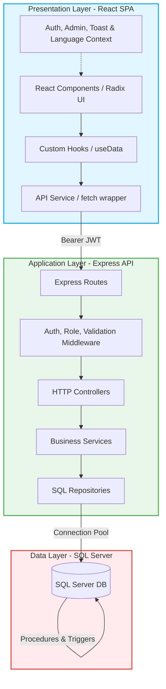

# 🛒 DBLAB - Hệ Thống Đi Chợ Tiện Lợi & Quản Lý Kho Thực Phẩm (Shopping Convenience System)

[](https://react.dev/)
[](https://nodejs.org/)
[](https://www.microsoft.com/en-us/sql-server)
[](LICENSE)

Dự án **Shopping Convenience System** là một hệ thống toàn diện hỗ trợ các gia đình lập kế hoạch bữa ăn, quản lý kho tủ lạnh, tự động hóa danh sách đi chợ, tối ưu hóa chi tiêu và giảm thiểu lãng phí thực phẩm. Hệ thống được thiết kế theo kiến trúc phân tầng chuẩn doanh nghiệp (**Enterprise-level**) đảm bảo tính bảo mật, hiệu năng và khả năng mở rộng cao.

---

## 🗺️ Bản đồ kiến trúc hệ thống (System Architecture)

Hệ thống được thiết kế theo mô hình **Client-Server** 3 lớp chuẩn hóa, giao tiếp thông qua API RESTful và sử dụng JWT kết hợp với HttpOnly Cookie để bảo mật các phiên làm việc:



1. **Presentation Layer (Frontend):** Ứng dụng Single Page Application (SPA) React 18 giao tiếp qua các API HTTP RESTful đến Backend. Tách biệt logic và giao diện thông qua Custom Hooks.
2. **Application Layer (Backend API):** Thiết kế dạng phân tầng MVC đơn giản hóa:
   * `Route` nhận yêu cầu HTTP.
   * `Middleware` kiểm duyệt xác thực người dùng (`authenticate`), phân vai trò (`role`) và validate payload (`validateRequest`).
   * `Controller` điều phối các luồng dữ liệu của request.
   * `Service` giải quyết logic nghiệp vụ của ứng dụng.
   * `Repository` thực hiện các truy vấn đọc ghi CSDL bằng các tham số hóa an toàn.
3. **Data Layer (Database):** CSDL SQL Server lưu trữ dữ liệu, thực hiện tối ưu hóa qua các Stored Procedures (VD: `sp_TaoNhomGiaDinh`, `sp_HoanThanhMuaSamKho`), Indexes và Views báo cáo (`vw_ThucPhamSapHetHan`, `vw_ThongKeMuaSam`).

---

## ✨ Các tính năng nổi bật (Key Features)

Dự án bao gồm **10 phân hệ chức năng chính** kết nối API thực tế đến backend SQL Server:

### 📊 1. Bảng điều khiển thông minh (Interactive Dashboard)
* **Thống kê thời gian thực:** Tóm tắt chi tiêu trong tháng, tổng thực phẩm hiện có trong kho, số lượng thành viên gia đình và tỷ lệ hoàn thành kế hoạch ăn uống lấy trực tiếp từ cơ sở dữ liệu qua các API thật.
* **Biểu đồ trực quan:** Trực quan hóa xu hướng chi tiêu hàng tuần/tháng và cơ cấu tiêu dùng theo danh mục thực tế.
* **Cảnh báo nhanh:** Hiển thị danh sách các thực phẩm sắp hết hạn theo thời gian thực để kịp thời tiêu thụ.
* **Thêm nhanh bữa ăn:** Hỗ trợ đặt lịch ăn trực tiếp từ Dashboard với việc chọn đúng món ăn (`maMon`) và lưu đúng ngày (`ngay`) được chọn từ giao diện.

### 🛒 2. Danh sách mua sắm thông minh (Smart Shopping List)
* **Tự động gom nhóm (Merge Duplicates):** Tự động gộp các nguyên liệu trùng tên và cùng đơn vị đo lường trong danh sách để dễ mua sắm.
* **Hoàn thành và Nhập kho tự động (Auto-Restock):** Khi đánh dấu "Đã mua" các mặt hàng và nhấn hoàn thành danh sách, Stored Procedure (`sp_HoanThanhMuaSamKho`) tại SQL Server sẽ tự động đẩy các thực phẩm này vào Kho thực phẩm của gia đình.
* **Xuất bản PDF thật:** Hỗ trợ in ấn danh sách mua sắm ra tệp PDF chất lượng cao thông qua cửa sổ in chuẩn của trình duyệt (`window.print()`).
* **Chia sẻ nhanh:** Tích hợp Web Share API cho thiết bị di động và cơ chế sao chép vào Clipboard trên PC.

### 🏪 3. Quản lý kho thực phẩm (Food Inventory)
* **Quản lý theo Lô (Batches):** Quản lý thực phẩm cùng tên nhưng lưu giữ theo từng lô ngày hết hạn riêng biệt để áp dụng nguyên lý **FIFO (First In, First Out)**.
* **Tiêu thụ nhanh thông minh:** Khi bấm trừ nhanh thực phẩm (`-1`), hệ thống tự động tìm và trừ số lượng của lô còn hàng có hạn sử dụng gần nhất.
* **Xem chi tiết thực phẩm:** Giao diện chi tiết hiển thị toàn bộ thuộc tính, lịch sử thay đổi của vật phẩm.
* **Nhật ký biến động kho (Audit Log):** Ghi nhận chi tiết mọi hành động biến động kho: `THEM_MOI`, `CAP_NHAT`, `TIEU_THU`, `XOA` vào bảng `NhatKyKho` để dễ dàng tra cứu thành viên thực hiện.

### 📅 4. Kế hoạch ăn uống & Gợi ý (Meal Planner)
* **Lên lịch ăn chi tiết:** Lập kế hoạch ăn uống cho các ngày trong tuần theo 4 loại bữa: *Sáng, Trưa, Tối, Phụ* (được ánh xạ đồng bộ `SANG`, `TRUA`, `TOI`, `PHU` lên database).
* **Tự động tạo kế hoạch:** Thuật toán phân tích kho thực phẩm hiện tại bằng gợi ý từ công thức (`recipesApi.suggest`) để lên thực đơn tối ưu dinh dưỡng, hạn chế mua đồ mới.
* **Tự động đi chợ (Auto Shopping Sync):** So sánh nguyên liệu công thức với kho thực phẩm hiện tại, tự động tính toán phần thiếu hụt và đẩy vào danh sách đi chợ chỉ bằng một click.

### 🍳 5. Công thức nấu ăn (Recipes)
* **Bộ sưu tập công thức:** Chia sẻ các công thức hệ thống chung và công thức riêng tư của gia đình (`groupId` được truyền đầy đủ để lọc công thức riêng tư).
* **Chế độ nấu ăn từng bước (Cooking Mode):** Tích hợp bộ đếm giờ (Timer) tự động phát hiện số phút trong hướng dẫn nấu. Tránh hoàn toàn việc render vô hạn nhờ khai báo hằng số tĩnh bên ngoài component.
* **Nấu xong trừ kho (Cook & Deduct):** Tính toán lượng nguyên liệu cần thiết dựa trên số khẩu phần ăn thực tế được nhập và trừ trực tiếp vào kho thực phẩm tương ứng thông qua giao dịch SQL Server.

### 📈 6. Báo cáo & Thống kê tài chính (Financial Reports)
* **Thống kê chi phí thật:** Thống kê chi tiêu thực tế dựa trên giá thực tế mua và lãng phí thực tế từ thực phẩm hết hạn (`TrangThai = 'HET_HAN'`).
* **Tính toán tiết kiệm thật (Real Savings):** Thống kê số tiền tiết kiệm dựa trên giá trị của các thực phẩm đã được tiêu thụ thành công trước khi hết hạn (`nk.HanhDong = 'TIEU_THU'`), truy vấn trực tiếp từ cơ sở dữ liệu (`TongTietKiem`).

### 👨‍👩‍👧‍👦 7. Quản lý thành viên gia đình (Family Management)
* **Mô hình chia sẻ dữ liệu gia đình (Family-sharing model):** Cho phép các thành viên trong cùng một gia đình sử dụng chung kho thực phẩm và danh sách mua sắm.
* **Quản trị thành viên thật:** Lưu thông tin thành viên (Họ tên, SĐT, tiểu sử) và đồng bộ trực tiếp lên Database.
* **Phân quyền và Cập nhật vai trò:** Hỗ trợ Trưởng nhóm (Leader) chuyển đổi quyền hạn của các thành viên (`LEADER`, `MEMBER`, `VIEWER`) và ghi nhận vào cơ sở dữ liệu thông qua API.

### ⚙️ 8. Cài đặt hệ thống (Settings)
* **Lưu trữ cấu hình thông báo:** Trạng thái bật/tắt cảnh báo thực phẩm hết hạn, nhắc nhở mua sắm được đồng bộ vào Database và LocalStorage.
* **Cập nhật thông tin cá nhân:** Thay đổi thông tin cá nhân và hỗ trợ tải ảnh đại diện thật (File upload thực tế kết nối với backend).
* **Xóa tài khoản an toàn:** Hộp thoại `ConfirmDialog` ngăn chặn vô tình xóa tài khoản, thực hiện xóa dữ liệu và đăng xuất sạch sẽ khỏi hệ thống.

### 🔑 9. Bảo mật xác thực & Điều hướng (Auth & Navigation)
* **Luồng bảo vệ Routes:** Sử dụng Route Guard để ngăn chặn truy cập không hợp lệ.
* **Chuyển hướng thông minh:** Khi access token hết hạn và refresh token thất bại, hệ thống tự động đẩy người dùng về đúng đường dẫn đăng nhập hệ thống (`/auth/login?expired=true`) thay vì trang 404.
* **Chống timeout chồng lấp:** Dashboard được bảo vệ khỏi việc click dồn dập chuyển hướng bữa ăn bằng cơ chế dọn dẹp timeout thông minh.

### 💻 10. API Bảng điều khiển quản trị (Admin Control)
* **Giám sát vận hành:** Bảng quản trị hệ thống giúp giám sát người dùng, Master Data, nhật ký hệ thống (Audit Logs) và thống kê vận hành.
* **Kiểm soát đầu vào:** Validate đầu vào bằng Zod schema nghiêm ngặt trước khi thực thi truy vấn database.
* **Ngưỡng hết hạn động:** Cho phép tùy chỉnh số ngày hết hạn thông qua query parameter `days` thay vì hardcode giá trị.

---

## 🛠️ Công nghệ sử dụng (Technology Stack)

### Frontend (Client)
* **Framework:** React 18, Vite 6
* **Routing:** React Router v7 (`react-router`)
* **Styling:** TailwindCSS v4 (`@tailwindcss/vite`), CSS Variables, Lucide Icons, Radix UI primitives (`@radix-ui/react-*`), Motion (`motion` cho vi hiệu ứng).
* **State Management:** Zustand, React Context
* **Forms & Validation:** React Hook Form (`react-hook-form`), JavaScript native validation.
* **Charts:** Recharts (phục vụ báo cáo tài chính).

### Backend (Server)
* **Runtime & Compiler:** Node.js (v18+), TypeScript (`ts-node` & `nodemon`).
* **Framework:** Express 5 (`express` v5.2.1) - bọc bằng native HTTP Server để tránh clean exit.
* **Database Connector:** `mssql` (v12.5.0 - Microsoft SQL Server Client sử dụng Connection Pool).
* **Validation:** Zod schemas (`zod` v4.3.6) làm middleware `validateRequest`.
* **Authentication & 2FA:** JSON Web Tokens (`jsonwebtoken` v9.0.3), băm mật khẩu `bcryptjs` v3.0.3, và cơ chế bảo mật TOTP tự phát triển dựa trên HMAC-SHA1 thông qua thư viện native `crypto` của Node.js.

### Database
* **DBMS:** Microsoft SQL Server (2019+)
* **Connection Port:** `1433`

---

## 📂 Cấu trúc thư mục dự án (Project Structure)

```text
DBLAB_ShoppingConvenienceSystem/
├── backend/
│   ├── dist/                # Mã nguồn JavaScript sau khi build từ TypeScript
│   ├── src/
│   │   ├── config/          # Cấu hình kết nối SQL Server (database.ts), JWT, Logger
│   │   ├── core/            # Middleware dùng chung, hằng số, helper (jwt, response)
│   │   ├── jobs/            # Tác vụ chạy ngầm định kỳ
│   │   ├── modules/         # Các module nghiệp vụ chính (Route -> Controller -> Service -> Repository)
│   │   │   ├── admin/       # Quản trị hệ thống, nhật ký Audit
│   │   │   ├── auth/        # Đăng ký, đăng nhập, 2FA
│   │   │   ├── family/      # Nhóm gia đình, lời mời
│   │   │   ├── inventory/   # Kho thực phẩm, batches, nhật ký kho
│   │   │   ├── meal-plan/   # Thực đơn, kế hoạch ăn uống
│   │   │   ├── recipes/     # Công thức nấu ăn, suggest
│   │   │   ├── reports/     # Thống kê chi phí, lãng phí
│   │   │   └── users/       # Thông tin cá nhân, avatar
│   │   ├── routes/          # API v1 routes entry point
│   │   ├── app.ts           # Khởi tạo Express
│   │   └── server.ts        # Khởi chạy native HTTP server
│   ├── package.json
│   └── tsconfig.json
├── frontend/
│   ├── src/
│   │   ├── app/
│   │   │   ├── components/  # Components dùng chung (Common, UI)
│   │   │   ├── context/     # Contexts (Auth, Admin, Language, Toast)
│   │   │   ├── hooks/       # Custom hooks (useData, useToast)
│   │   │   ├── layouts/     # MainLayout, AuthLayout, AdminLayout
│   │   │   ├── pages/       # Các trang chính (Dashboard, ShoppingList, Inventory...)
│   │   │   ├── services/    # api.ts (fetch wrapper + Silent Refresh)
│   │   │   ├── utils/       # Định dạng tiền tệ, avatar, thời gian
│   │   │   └── routes.tsx   # Phân tuyến Router v7 & Guards
│   │   ├── main.tsx
│   │   └── index.html
│   ├── package.json
│   └── vite.config.ts
├── database/
│   ├── schema/              # Script khởi tạo SQL Server (01_init.sql đến 07_events.sql)
│   ├── migrations/          # Bản nâng cấp CSDL di trú (001_ đến 010_)
│   └── database.slnx        # Solution Visual Studio
├── docs/                    # Tài liệu API, báo cáo kỹ thuật (.tex), UML (.drawio)
├── BUG_REPORT.md            # Báo cáo chi tiết 47 lỗi full-stack phát hiện khi audit
└── README.md                # Hướng dẫn này
```

---

## 🗃️ Thiết kế Cơ sở dữ liệu (Database Design)

Hệ thống sử dụng cơ sở dữ liệu quan hệ gồm 14 bảng trên SQL Server:

1. **`NguoiDung`:** Lưu tài khoản người dùng, vai trò (`ADMIN`, `MEMBER`), trạng thái (`ACTIVE`, `LOCKED`), mật khẩu băm, mốc đổi mật khẩu gần nhất (`MatKhauNgayCapNhat`) và khóa bí mật 2FA (`TwoFactorSecret`, `IsTwoFactorEnabled`).
2. **`NhomGiaDinh`:** Thông tin các nhóm gia đình, trưởng nhóm (`TruongNhom`), giới hạn thành viên và mô tả.
3. **`ThanhVienNhom`:** Bảng liên kết nhiều-nhiều giữa người dùng và nhóm gia đình kèm vai trò trong nhóm (`LEADER`, `MEMBER`, `VIEWER`).
4. **`FamilyInvites`:** Quản lý mã mời vào nhóm gia đình (`Code`), giới hạn số lần sử dụng (`MaxUses`), số lần đã dùng (`UsedCount`) và ngày hết hạn.
5. **`FamilyNotifications`:** Nhật ký hoạt động nhóm (`JOIN`, `LEAVE`, `TRANSFER`, `INFO_UPDATE`).
6. **`DanhSachMuaSam`:** Quản lý các phiên đi chợ của gia đình với các trạng thái (`DANG_TAO`, `COMPLETED`).
7. **`ChiTietMuaSam`:** Mặt hàng trong danh sách đi chợ, số lượng, đơn vị, giá dự kiến, giá thực tế, trạng thái đã mua, người phụ trách và người thực tế tích mua hàng.
8. **`KhoThucPham`:** Kho thực phẩm gia đình, quản lý theo lô ngày hết hạn (`HanSuDung`), số lượng hiện tại, vị trí lưu trữ (`Fridge`, `Freezer`, `Pantry`) và cột `Version` để kiểm soát xung đột đồng thời (OCC).
9. **`NhatKyKho`:** Lưu vết biến động kho (`THEM_MOI`, `CAP_NHAT`, `TIEU_THU`, `XOA`), ghi nhận số lượng trước/sau, đơn vị và người thực hiện.
10. **`MonAn`:** Công thức nấu ăn (hệ thống hoặc riêng tư của nhóm gia đình), lưu trữ metadata (thời gian chuẩn bị, số khẩu phần, độ khó, danh mục, hình ảnh).
11. **`NguyenLieuMon`:** Chi tiết định lượng nguyên liệu cần thiết cho công thức liên kết với vật phẩm kho.
12. **`KeHoachBuaAn`:** Lịch trình thực đơn ăn uống theo ngày và buổi (`SANG`, `TRUA`, `TOI`, `PHU`), lưu khẩu phần và bản sao tên món ăn.
13. **`BaoCaoChiTieu`:** Bảng chốt số liệu tài chính tài khóa (tổng chi phí đi chợ thực tế, tổng lãng phí thực tế, số thành viên lịch sử và tổng calo tích lũy).
14. **`AuditLogs`:** Nhật ký thao tác hệ thống của quản trị viên (Admin).

---

## ⚙️ Hướng dẫn cài đặt & Khởi chạy (Installation & Setup)

### 1. Yêu cầu hệ thống
* **Node.js** v18.0.0 hoặc cao hơn.
* **SQL Server** 2019+ (Chạy Local hoặc Azure SQL).
* Đảm bảo dịch vụ **SQL Server Agent** đang chạy (Running) để phục vụ lập lịch tự động.

### 2. Thiết lập Cơ sở dữ liệu (Database Setup)
1. Tạo một cơ sở dữ liệu trống tên là `shoppingdb` trong SQL Server.
2. Chạy lần lượt các script khởi tạo schema trong thư mục `database/schema/`:
   * `01_init.sql` - Tạo DB và cấu hình UTF-8.
   * `02_tables.sql` - Tạo các bảng cơ bản của hệ thống.
   * `03_indexes.sql` - Tạo index tăng tốc độ truy vấn.
   * `04_views.sql` - Tạo view báo cáo thống kê.
   * `05_triggers.sql` - Tạo trigger cập nhật trường `NgayCapNhat` tự động.
   * `06_procedures.sql` - Tạo các thủ tục lưu trữ (`sp_TaoNhomGiaDinh`, `sp_HoanThanhMuaSamKho`).
   * `07_events.sql` - Tạo mẫu SQL Server Agent Job tự động cập nhật hàng hết hạn mỗi ngày.
3. Nạp dữ liệu mẫu bằng cách chạy script trong `database/seed/01_seed_all.sql`.
4. Áp dụng các bản cập nhật di trú tuần tự từ thư mục `database/migrations/`:
   * Áp dụng từ tệp `001` đến tệp `010` để cập nhật cấu trúc cột mới, bảng nhật ký `NhatKyKho` và bảng `AuditLogs`.

### 3. Cài đặt Backend
1. Di chuyển vào thư mục backend:
   ```bash
   cd backend
   ```
2. Cài đặt các gói phụ thuộc:
   ```bash
   npm install
   ```
3. Tạo file cấu hình môi trường `.env` nằm tại thư mục gốc của thư mục `/backend` với các nội dung sau:
   ```env
   SERVER_PORT=5000
   NODE_ENV=development
   CLIENT_URL=http://localhost:5173

   # Cấu hình kết nối SQL Server
   DB_HOST=localhost
   DB_INSTANCE=MSSQLSERVER01   # Để trống nếu không dùng instance name
   DB_USER=your_username
   DB_PASS=your_password
   DB_NAME=shoppingdb
   DB_PORT=1433

   # Cấu hình bảo mật JWT
   JWT_SECRET=your_super_secret_jwt_key_change_this_later
   JWT_EXPIRE=24h
   ```
4. Khởi chạy Backend ở chế độ phát triển (sử dụng nodemon):
   ```bash
   npm run dev
   ```
   *Backend API sẽ chạy tại địa chỉ `http://localhost:5000`.*

### 4. Cài đặt Frontend
1. Di chuyển vào thư mục frontend:
   ```bash
   cd ../frontend
   ```
2. Cài đặt các gói phụ thuộc:
   ```bash
   npm install
   ```
3. Tạo file cấu hình môi trường `.env.local` nằm tại thư mục gốc của thư mục `/frontend` với các nội dung sau:
   ```env
   VITE_API_URL=http://localhost:5000/api/v1
   ```
4. Khởi chạy Frontend ở chế độ phát triển (sử dụng Vite):
   ```bash
   npm run dev
   ```
   *Frontend sẽ chạy tại địa chỉ `http://localhost:5173`.*

---

## 🛡️ Các cơ chế cốt lõi & Tính năng bảo mật (Core Mechanisms)

1. **Kiểm soát xung đột đồng thời (Optimistic Concurrency Control - OCC):**
   * Được áp dụng tại bảng `KhoThucPham` qua cột `Version`. Khi cập nhật số lượng hoặc trạng thái của thực phẩm, câu lệnh SQL sẽ kiểm tra chéo:
     ```sql
     UPDATE KhoThucPham 
     SET SoLuong = @sl, Version = Version + 1
     WHERE MaTP = @id AND Version = @v
     ```
   * Nếu hai thành viên trong gia đình cùng thay đổi số lượng thực phẩm tại cùng một thời điểm, thao tác của người thứ hai sẽ bị từ chối (trả về `false` do số hàng bị ảnh hưởng là 0) để ngăn chặn việc ghi đè sai lệch dữ liệu (Dirty Write).

2. **Làm mới phiên làm việc ngầm (Silent Token Refresh) & Concurrent Refreshing:**
   * Access Token có thời gian sống ngắn, lưu hoàn toàn trong bộ nhớ (Memory State) của ứng dụng để tránh rò rỉ qua LocalStorage.
   * Refresh Token được lưu trong `HttpOnly Cookie` của trình duyệt. 
   * Khi ứng dụng nhận mã lỗi `401 Unauthorized` từ API, API Service (`api.ts`) tự động tạm dừng các yêu cầu tiếp theo thông qua mảng `refreshSubscribers`, thực hiện yêu cầu POST ngầm đến `/auth/refresh` để nhận một cặp token mới và tự động thực hiện lại (retry) yêu cầu gốc mà người dùng không hề nhận thấy.

3. **Lọc múi giờ báo cáo tài chính (Timezone Offset Security):**
   * Để tránh việc chênh lệch ngày báo cáo khi máy chủ chạy múi giờ UTC khác với múi giờ người dùng (ví dụ: UTC+7 tại Việt Nam), mọi yêu cầu thống kê tài chính đều truyền tham số `timezoneOffset` (tính bằng phút) lên backend. 
   * Backend SQL query sử dụng hàm `DATEADD` và `CAST` để chuẩn hóa mốc thời gian khớp với múi giờ địa phương của gia đình trước khi tính toán tổng chi tiêu và tiết kiệm.

4. **Kiểm tra dữ liệu đầu vào (Zod Validation):**
   * Backend Express sử dụng middleware kiểm duyệt dữ liệu đầu vào bằng thư viện `Zod`. Mọi request body, query params đều được đối chiếu chặt chẽ với Schema trước khi thực thi để ngăn chặn các cuộc tấn công injection hoặc dữ liệu không hợp lệ.

---

## 🚀 Trạng thái dự án & Lịch sử sửa lỗi (Project Status & Fixes)

Hệ thống đã trải qua một cuộc kiểm duyệt toàn diện và bảo mật cấp Senior Staff Engineer, sửa đổi triệt để **tất cả 47 lỗi full-stack** được liệt kê trong [BUG_REPORT.md](BUG_REPORT.md). Các vấn đề cốt lõi đã được giải quyết:

### 🛡️ Nâng cấp Bảo mật & Xác thực
* **Enforce Vai trò & Authorization:** Loại bỏ toàn bộ các điều kiện bypass `localhost` ở middleware `authorizeRole` và `requireGroupRole` trong [role.middleware.ts](file:///backend/src/core/middleware/role.middleware.ts). Bất kỳ truy cập nào đều phải xác thực chính danh và phân quyền chuẩn xác.
* **Xử lý Access Token An toàn:** Loại bỏ lưu trữ Access Token trong `localStorage` để triệt tiêu nguy cơ bị đánh cắp qua tấn công XSS. Access Token được giữ hoàn toàn trong bộ nhớ tạm (in-memory) và tự động hồi phục qua HttpOnly Cookie Rotation.
* **Vô hiệu hóa Token khi đổi mật khẩu:** Khi thực hiện đổi mật khẩu ở [users.repository.ts](file:///backend/src/modules/users/users.repository.ts), CSDL tự động cập nhật trường `MatKhauNgayCapNhat` thành `GETUTCDATE()`. Middleware xác thực đối chiếu mốc thời gian này để lập tức vô hiệu hóa các JWT cũ đang lưu hành.
* **TOTP 2FA Hoàn thiện:** Khai báo đầy đủ các api cấu hình 2FA (setup, enable, disable) trên frontend và kết nối giao diện Settings an toàn.

### 🗃️ Tối ưu hóa Database & Concurrency
* **Cooking Transaction & locks:** Nghiệp vụ trừ kho khi nấu ăn (`deductInventoryForCooking`) được bọc hoàn toàn trong giao dịch (SQL Transaction) kết hợp với từ khóa khóa hàng `WITH (UPDLOCK, ROWLOCK)`. Điều này ngăn chặn triệt để hiện tượng race condition khi 2 thành viên gia đình cùng xác nhận nấu 1 món ăn làm kho bị âm số lượng.
* **Triệt tiêu N+1 Query:** Loại bỏ correlated subqueries lồng nhau trong báo cáo lãng phí và tài chính, tối ưu hóa các lệnh join để tăng tốc độ phản hồi đáng kể.
* **Chuẩn hóa Enum Trạng thái:** Đồng bộ hóa logic check trạng thái đi chợ và kho giữa client (`hoan_thanh`) và database (`COMPLETED`/`HOAN_THANH`), tránh rò rỉ hoặc sai lệch trạng thái thực phẩm (`'HET_HAN'` thay vì ghi nhầm thành `'HET'`).

### 💻 Hoàn thiện Giao diện & API Logic
* **Kết nối Dashboard Real-time:** Thay thế toàn bộ các số liệu tĩnh giả lập trên dashboard bằng các query đếm người dùng, chi tiêu thực tế, và tỷ lệ hoàn thành bữa ăn kế hoạch từ CSDL.
* **Sửa lỗi tính Toán Chi phí:** Điều chỉnh độ ưu tiên toán tử trong [ShoppingList.tsx](file:///frontend/src/app/pages/ShoppingList/ShoppingList.tsx) (`s + (i.actualPrice || i.price)`) để trả về đúng hóa đơn mua sắm thực tế.
* **Shopping Actions:** Hoàn thiện logic in xuất PDF thật, chia sẻ Web Share API và sao chép liên kết cho Danh sách đi chợ.
* **Inventory Batch & UI:** Sửa lỗi submit modal thêm thủ công, nút giảm nhanh `-1` trừ đúng lô thực phẩm có hạn dùng gần nhất thay vì lấy mù quáng phần tử đầu mảng.
* **Meal Plan & Recipes:** Hỗ trợ bữa phụ (`'PHU'`), dropdown công thức tải chính xác các món riêng tư của gia đình bằng cách truyền `groupId` thích hợp, và sửa vòng lặp render vô tận trong Cooking Mode.

---

## 🔮 Hướng đi tương lai (Roadmap)

* [ ] **Tác vụ chạy ngầm gửi email cảnh báo:** Tích hợp dịch vụ Nodemailer hoặc SendGrid gửi email tự động quét hàng ngày các thực phẩm sắp hết hạn dựa trên SQL Agent Job.
* [ ] **Quét hóa đơn mua sắm OCR:** Sử dụng Google Cloud Vision API hoặc Tesseract.js để chụp ảnh hóa đơn siêu thị và tự động nạp kho thực phẩm của gia đình.
* [ ] **Gợi ý món ăn AI (LLM Integration):** Tích hợp Gemini API phân tích nguyên liệu sắp hết hạn thực tế trong kho để đề xuất các công thức nấu ăn sáng tạo và tối ưu hóa chi tiêu.
* [ ] **Chế độ Ngoại tuyến (Offline Sync):** Cấu hình PWA (Progressive Web App) và Service Worker để lưu trữ checklist đi chợ khi mất sóng điện thoại dưới tầng hầm siêu thị và tự động đồng bộ khi có mạng.

---

## 📄 Bản quyền (License)

Dự án được phân phối dưới giấy phép **MIT License**. Xem chi tiết tại tệp `LICENSE`.
